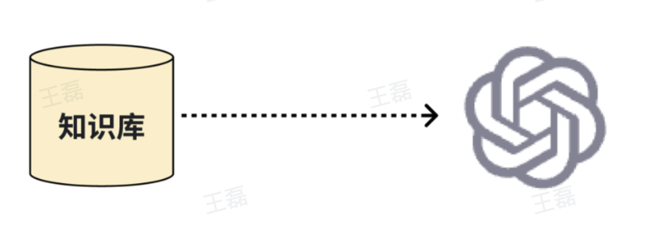
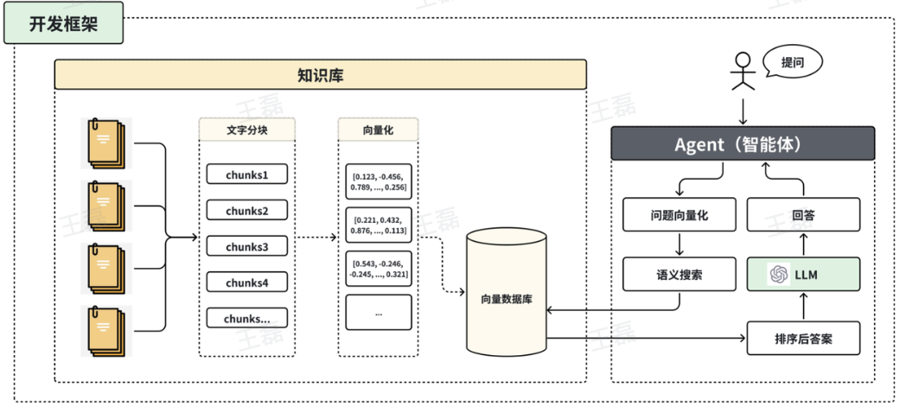

# AI全栈题目

## 问题1：LLM 是什么​

LLM 是 “Large Language Model”，中文叫 大语言模型。一种基于深度学习的人工智能模型，通过学习海量文本数据，掌握语言规律，从而能够理解、生成、推理和总结自然语言。从语言中学出逻辑， 而不仅仅是会说话。参数是模型“语言理解和知识记忆”的核心。参数越多，几十亿到上千亿个参数，模型的理解和生成能力越强。

## 问题2：目前热门 LLM 大模型​

- **OpenAI 系列**：GPT-4.1、GPT-5 是通用能力最强的代表，支持多模态、工具调用和长上下文，是企业级 AI 的首选。

- **Claude 系列（Anthropic）**：以安全、逻辑一致和长文本能力著称，在写作、知识推理方面表现出色。

- **Gemini 系列（Google）**：主打多模态，结合搜索和视频理解能力。

- **LLaMA 系列（Meta）**：最受欢迎的开源模型，广泛用于微调与本地部署，性能与开放性兼顾。

- **DeepSeek 系列**：强化推理与逻辑一致性，代表开源社区在数学和代码领域的突破。

- **Qwen 系列（阿里）**：中文表现最强的开源模型之一，适合国内业务与多轮对话场景。

- **Kimi 系列（Moonshot）**：主打超长上下文和文档理解，适合知识管理和阅读类应用。

- **Mistral / Phi / Gemma**：轻量高效，适合边缘部署与中小规模应用。

## 问题3：关于 AI 的名词解释​

- Prompt（提示词）  
  给大模型的输入指令，用来控制模型行为、回答风格或思维方式。  
  Prompt 工程就是通过设计语言，让模型 "按你的逻辑思考"。

- LLM（Large Language Model）  
  大语言模型，通过学习海量文本掌握语言规律，能理解、生成和推理自然语言。  
  如： GPT、Claude、Qwen、Kimi、Gemini 等。

- RAG（Retrieval-Augmented Generation）  
  检索增强生成。先从向量数据库检索相关资料，再交给模型生成答案，  
  可让模型"有依据可依"，减少幻觉。

- Fine-tuning（微调）  
  对已有模型进行二次训练，让它在特定领域表现更好。适合定制行业模型或个性化助手。

- Agent（智能体）  
  具备自主思考与行动能力的 AI 系统。能自己规划任务、调用工具、执行操作，是"AI 工程师"的雏形。

- Tool（工具函数）  
  模型在 Agent 模式中可调用的外部功能，比如查天气、调用接口、读数据库。

- Function Calling（函数调用）  
  模型输出 JSON，告诉你要调用哪个函数、传什么参数。是让模型"做事"的关键机制。

- MCP（Model Context Protocol）  
  OpenAI 推出的模型交互协议，让模型与 IDE、浏览器、文件系统直接通信，是下一代 AI 操作系统标准。

- Prompt Injection（提示注入）  
  攻击方式：用户在输入中嵌入恶意指令，让模型执行错误行为。工程上需过滤和权限控制。

- Embedding（向量嵌入）  
  把文本转成高维向量表示语义。在搜索、RAG、语义匹配中常用。

## 问题4：关于全栈名词解释​

- **BFF（Backend For Frontend）**  
  前后端分离架构中，为前端量身定制的后端层，负责接口聚合、权限控制、Session 管理等。

- **SSR（Server-Side Rendering）**  
  服务端渲染。页面由服务器生成 HTML 后再返回浏览器，提高首屏性能和 SEO 效果。

- **Monorepo（单仓多包）**  
  一种代码管理方式，把多个子项目统一放在一个仓库中，用 pnpm、TurboRepo 等工具统一构建与依赖。

- **CI/CD（持续集成 / 持续部署）**  
  自动化构建与发布流程：代码提交后自动测试、打包、部署。如： Jenkins、GitHub Actions、GitLab CI 等

- **Docker / 容器化**  
  把应用及其依赖封装进独立环境中运行。可实现"一次构建，到处运行"。

## 问题5：大模型在 ToB 领域中应用的常见问题​

- LLM 泛知识，无法回答企业内部知识，譬如员工电话号码，部门规章制度，相关守则 等等。​
- LLM 会有致幻问题，有产生幻觉的可能，不适用于企业应用的正式环境。​
**解决方案**：为模型外挂一个知识库，辅助 LLM 回答问题。 （RAG）



## 问题6：LLM 出现幻觉（Hallucination）的深层原因是什么​

- **语言模型是概率模型，不是事实模型**：LLM 的本质是"预测下一个最可能的词"，不是在"查找真相"，而是在生成语言模式。当输入提示不明确或知识缺失时，会凭统计相关性"合理地编造"。

- **训练数据中存在噪声和虚假样本**：大模型学习了互联网上的海量文本，而这些内容本身可能包含错误或臆测信息。模型学到这些偏差后，在回答中会自然复现。

- **缺乏事实验证机制**：模型输出结果时不会自动校验真伪，也不会访问实时数据。在多轮推理中，错误会被"递进强化"——尤其是 Agent 模式下的反射循环，会放大错误逻辑。

- **Prompt 上下文过短或缺乏约束**：当上下文被截断、知识片段不完整，模型会自动"补空缺"，生成符合语义但不符合事实的回答。

- **任务模糊或目标歧义**：如果任务没有明确评价标准，模型会更倾向于填补内容空白，从而编造细节。

## 问题7 ：RAG （检索增强生成）是什么？​

RAG（Retrieval-Augmented Generation）是当前企业级 AI 应用最核心的架构思路之一。​

让模型“具备最新知识”，而不依赖模型固有训练语料。​

1. **文档嵌入（Embedding）**
    - 把知识库（PDF、Markdown、数据库内容等）切成小块（Chunk）
    - 然后用 Embedding Model（如 text-embedding-3-large 或 bge-m3）将文本转为高维向量

2. **向量检索（Vector Search）**
    - 用户提问时，将 Query 也转成向量
    - 计算 Query 向量与文档向量的相似度
    - 检索出最相关的若干段落

3. **增强生成（Augmented Generation）**
    - 把检索结果拼入 Prompt 的上下文中
    - 交由 LLM 生成最终回答

## 问题8：RAG（检索增强生成）的原理与工程实现方式。​

- **录入流程**：文档 -> 切片 -> 向量化处理 -> 存入向量数据库​
- **Agent 流程**：提问 -> 问题向量化 -> 语义检索（到向量数据库） -> 答案排序整理 -> LLM处理 -> 回答



## 问题9：前端实现 LLM 的流式输出

使用 **Server-Sent Events (SSE)**：可参考本文档网络板块的 SSE 实现。​

这里介绍  OpenAI SDK ：​

- 提供 `stream: true` 参数；​
- 每生成一段内容就通过 `data:` 推送到前端。

```js
// 后端​
const response = await openai.chat.completions.create({​
  model: "gpt-4o-mini",​
  stream: true,​
  messages: [{ role: "user", content: "asdwasxdjqdwqjqdwjb" }],​
});​
for await (const chunk of response) {​
  res.write(`data: ${chunk.choices[0]?.delta?.content || ''}\n\n`);​
}​
​
// 前端​
const eventSource = new EventSource("/api/chat");​
eventSource.onmessage = (e) => {​
  appendToChat(e.data);​
};
```

## 问题10 ：Function Calling 是什么 ​

Function Calling 是 OpenAI 提出的早期结构化调用机制。​
**核心**：让模型可以“主动调用外部函数”，而不是只生成文本。

## 问题11：Function Calling 原理流程​

1. 开发者向模型注册函数定义（名称、参数 schema）。

    ```js
    functions: [{​
        name: "getWeather",​
        parameters: {​
            type: "object",​
            properties: { city: { type: "string" } },​
            required: ["city"]​
        }​
    }]
    ```

2. 模型推理后生成结构化 JSON（指明要调用哪个函数、参数是什么）。

    ```json
    {​
        "name": "getWeather",​
        "arguments": { "city": "Guangzhou" }​
    }
    ```

3. 开发者执行该函数，并把结果返回给模型，模型再继续生成答案。

    ```js
    const result = getWeather("Guangzhou")
    ```

## 问题12：Function Calling 优缺点​

优点：​

- 简单易用；​
- 提高模型可控性；​
- 支持多步对话任务执行。​

缺点：​

- 只能在模型调用时“注册函数”，不具备统一协议；​
- 不支持跨语言、跨模型的工具共享；​
- 无法标准化工具描述和安全权限控制；​
- 工具执行结果必须人工中转。

## 问题13：MCP 是什么？​

MCP = Model Context Protocol）​

它是 OpenAI 在 2024 年底正式推出的下一代 AI Agent 协议标准。​

它是 Function Calling 的“体系化升级版”。​

定义一套 模型 ↔ 工具 ↔ 上下文 的标准通信协议，让模型具备“插件化操作系统”能力。

## 问题14：MCP 的核心结构​

Server（工具服务端）：提供一组可用的工具（如文件读写、数据库、HTTP请求等）；​

Client（模型或 IDE）：通过协议访问 Server；​

Bridge（中间层）：负责转发、权限、上下文同步。​

交互流程：LLM -> MCP Client -> MCP Server（工具集）-> 外部资源

## 问题15：Function Calling 与 MCP 实现差异

**Function Calling 版本​**

模型调用 getStockPrice('AAPL') 获取苹果股价：

    ```js
    // 模型 → JSON → 你手动调用 API → 返回结果 → 再交给模型。​
    functions: [{​
        name: "getStockPrice",​
        parameters: { type: "object", properties: { symbol: { type: "string" } } }​
    }]
    ```

**MCP 版本​**

模型通过 MCP 直接访问股票工具服务：

    ```js
    // MCP Server 自动处理，模型无需开发者中转​
    // 调用外部 API -> 校验权限 -> 结果通过协议返回给模型​
    {​
        "action": "tools.call",​
        "tool": "stocks.getPrice",​
        "args": { "symbol": "AAPL" }​
    }
    ```
​
## 问题16：Function Calling 与 MCP 对比

| 对比维度 | Function Calling | MCP |
|---------|-----------------|-----|
| 定义者 | OpenAI(2023) | OpenAI(2024,正式标准) |
| 核心目标 | 模型调用外部函数 | 模型与外部环境标准化交互 |
| 安全机制 | 开发者自管 | 协议内建权限系统 |
| 语言兼容性 | 局限于SDK | 任意语言（JSON-RPC） |
| 工具发现 | 静态注册 | 动态发现/热加载 |
| 应用场景 | 单模型任务执行 | 多Agent协作/IDE集成/系统级控制 |

## 问题17：Agent 是什么​

Agent（智能体）在 AI 语境下，指的是一种具备自主决策能力的执行单元。不是简单的「调用模型」，而是围绕一个目标，能够感知环境、规划步骤、调用工具、执行行动并根据反馈调整策略的系统。​

Agent = **模型能力（大语言模型）** + **记忆** + **工具调用** + **状态感知与反馈循环** + **行动策略**

## 问题18：Agent Loop 是什么什么 ​

Agent Loop（循环反射机制） 是大模型在执行任务时不断进行 计划 → 执行 → 观察结果 → 再计划 的循环过程，不再是一次性输出答案，而是会根据每一步的执行结果决定下一步要做的事情。​

**基本流程**：​

- 用户提出一个任务，比如"查库存，不够就补货"。​
- Agent 首先生成一个计划（我应该先查库存）。​
- Agent 调用工具或 API 执行计划（比如请求库存接口）。​
- 得到执行结果后，模型会"反思"当前状态（库存低于阈值，需要继续执行下一步）。​
- 再次生成计划，比如调用下单接口。​
- 直到模型判断任务已经完成，才停止循环并给出最终回答。​

**LLM = 决策器，Tool = 手执行的工具，Loop = 自己驱动自己继续做事**

## 问题19：Agent Loop 常见问题与风险​

- **容易进入死循环**：模型可能一直在"再确认、再检查"，不停止，如不断重复 "确认库存" 这种无意义操作。​
- **Token 消耗极高**：每一次反射都要重新发送上下文，调用多轮 API，很快消耗大量 Token，造成巨大成本问题。​
- **错误行为会被放大**：如果第一次 Observation 理解错误，模型可能继续沿着错误方向一错再错。​
- **缺乏安全边界**：如果工具没有做白名单和参数校验，模型可能不加限制地执行敏感操作。

## 问题20：什么是模型微调（Fine-tuning）？​

Fine-tuning 是在预训练模型基础上，使用特定领域的数据再次训练，让模型在该领域表现更好。当于“教模型新知识”或“让模型形成固定风格”。重新训练部分或全部权重，使模型从数据中学习新模式。

## 问题21：LLM 微调中常见的两种类型是什么？各适合什么场景？​

- 全参数微调（Full Fine-tuning）​
  - 调整模型全部参数。​
  - 优点：效果最好。缺点：计算量大、成本高。​
  - 适合：大型机构、科研或完全垂直场景（如法律、医学）。​
- 轻量微调（Parameter Efficient Fine-tuning, PEFT）​
  - 只调整少量参数，如 LoRA、QLoRA、Prefix-Tuning。​
  - 优点：显著降低显存需求；缺点：泛化略弱。​
  - 适合：中小团队做领域定制或角色微调。

## 问题22：LoRA 是如何实现高效微调的？​

LoRA（Low-Rank Adaptation）在原模型权重矩阵旁边插入两个低秩矩阵（A、B），在训练时只更新这两个小矩阵，原始权重冻结。相当于 W' = W + A × B这样显存消耗下降 90%+，训练速度提升数倍。​

LoRA 的核心思想是“用低维近似表达参数变化”。

## 问题23：微调一个 LLM 需要准备哪些数据？格式上有什么要求？​

- 指令数据（Instruction + Response）：模型学会根据任务指令输出结果。​
- 对话数据（Chat Format）：多轮上下文格式，适合聊天类模型。​
- 知识数据（Context + QA）：强化领域知识问答能力。​

**注意事项**：​

- 样本数量不求多，但要高质量、结构一致；​
- 去除噪声与矛盾样本；​
- 统一 token 长度与风格。

## 问题24：Dify 是什么？​

Dify 是一个开源的 AI 应用构建平台（AI App Builder），可以让开发者和非技术人员通过可视化界面快速搭建大模型应用。把 Prompt、变量、知识库、工作流、模型调用都组件化，无需从零写代码即可实现一个可用的 ChatBot、问答系统或业务助手。本质上，Dify 是连接“模型能力”和“业务场景”的中间层。

## 问题25：Dify 的 Workflow（工作流）是什么？​

Workflow 是 Dify 的核心功能之一，用于定义 AI 应用的执行流程。解决了单一 Prompt 无法处理复杂逻辑的问题， 让模型具备“多步决策”和“自动化任务执行”的能力。可以让模型在多个步骤中依次调用：​

- 模型推理（LLM Node）​
- 外部 API（HTTP Node）​
- 条件判断（If/Else Node）​
- 工具执行（Tool Node）​
- 数据处理（Code Node）

## 问题26：Dify 如何接入外部 API 或数据库？​

- HTTP 节点：在 Workflow 中可直接调用第三方 API；​
- 插件（Tool）机制：可自定义工具包，通过 REST 接口或函数实现；​
- Webhook 回调：可让外部系统触发 Dify 应用或获取执行结果；​
- SDK / API 调用：开发者可通过 Dify SDK 在代码中与应用通信。

## 问题27：Dify 的知识库（Knowledge Base）在 RAG 中起什么作用？​

Dify 的知识库是实现 RAG（检索增强生成）的关键模块。当用户上传文档、网页或文本时，Dify 会自动：​
分片（Chunking）：将文档拆成小块；​

1. 向量化（Embedding）：把文本转为向量；​
2. 语义检索（Retrieval）：根据用户问题查找最相关内容；​
3. 上下文拼接（Augmentation）：把检索结果加入 Prompt；​
4. 生成回答（Generation）：LLM 生成基于事实的回答。

## 问题28：在 Dify 中，如何让一个应用支持多轮上下文对话？​

Dify 内部有 Session 管理机制，每次用户对话会自动维护上下文变量（Messages）。开发者可通过：​

- 设置「对话记忆」开关；​
- 控制上下文保留的轮数；​
- 在 Prompt 中引用历史内容 {conversation_history}；​

来实现连续对话、上下文理解和逻辑衔接。这样用户可以和 AI 连续交流，不会“忘记前一句话”。

## 问题29：Dify 中 智能体 和 工作流 的关系​

智能体是执行任务的主体，而工作流是智能体执行任务的流程逻辑。智能体是谁来做，做什么，工作流是怎么做。智能体是AI的大脑，工作流是AI的行动路线。两者结合让 AI 真正落地成可控的业务流程。​

**智能体（Agent）​**

是具备自主决策与调用能力的 AI 实体。它基于系统提示（System Prompt）、工具（Tools）和记忆机制来完成任务。你可以在 Dify 里配置一个 Agent，让它具备特定的知识库、角色和功能，比如“财务助理”或“产品顾问”。​

**工作流（Workflow）​**

是一条任务执行链，用可视化节点描述任务的执行顺序。每个节点可以是一个模型调用、判断逻辑、API 请求、工具操作、甚至另一个 Agent 调用。工作流让任务执行可控、可调试、可复用。​

**工作流是智能体的执行骨架​**

智能体可以看作一个“驱动核心”，但如果要让它完成多步骤逻辑，就需要工作流定义步骤。​

  - 智能体：理解用户意图；​
  - 工作流：调用不同节点 → 检索知识库 → 调 API → 汇总输出。​

**智能体可以被工作流调用​**

在工作流中，一个节点可以是「Agent Node」，用于调用特定智能体执行子任务。​
比如一个“客服工作流”中可调用不同智能体：​

  - FAQ 智能体 → 回答常见问题；​
  - 工单智能体 → 记录或升级问题。​

**两者互补​**

  - 工作流负责“逻辑控制、条件判断、执行顺序”；​
  - 智能体负责“语言理解、推理、任务决策”。合起来就是“会思考 + 会执行”的完整自动化系统。