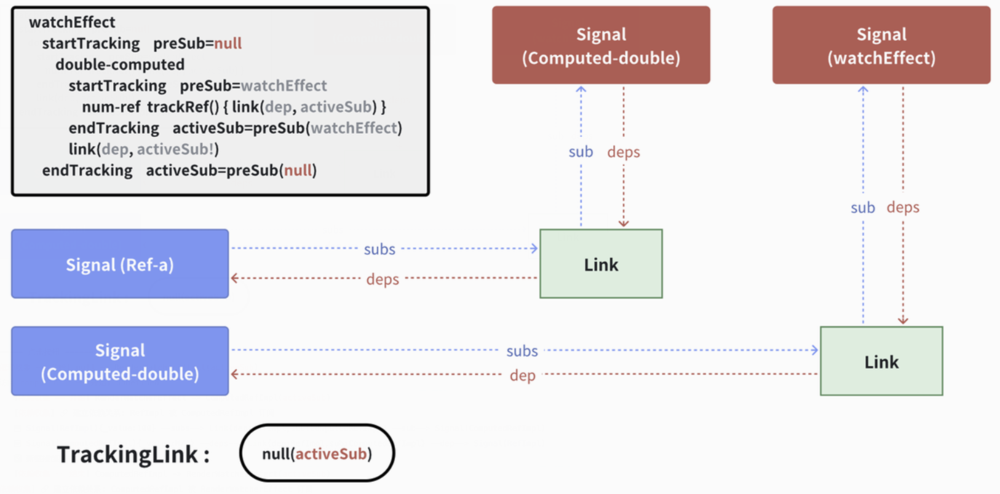
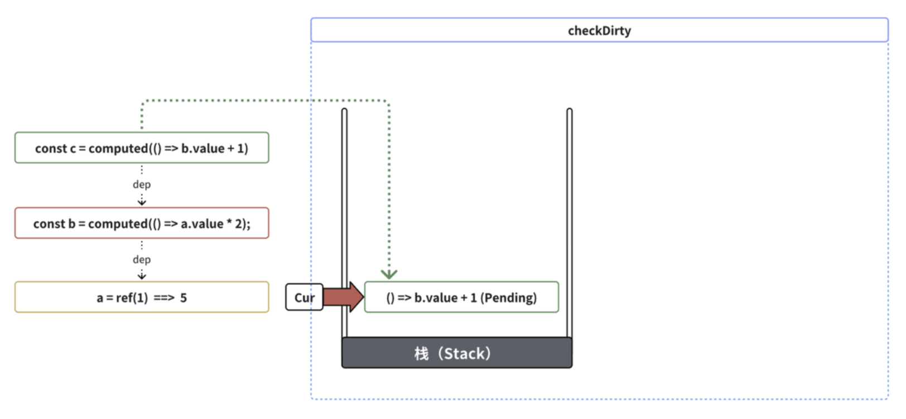

# Vue题目

## 问题1：Vue2 不能监听数组下标原因 ​

- Vue 2 用的是 Object.defineProperty 劫持数据实现数据视图双向绑定。
​
- Object.defineProperty 是可以劫持数组的​

```js
const arr = [1, 2, 3, 4];​
Object.keys(arr).forEach(function(key) {​
  Object.defineProperty(arr, key, {​
    get: function() {​
      console.log('key:' + key)​
    },​
    set: function(value) {​
      console.log('value:' + value)​
    }​
  });​
});​
arr[1];​
arr[2] = 4;​
```

- 真实情况：是 Object.defineProperty 可以劫持数组而 vue2 没有用来劫持数组。​

- 原因：Object.defineProperty 是属性级别的劫持，如果按上面代码的方式去劫持数组，随着数组长度增加，会有很大的性能损耗，导致框架的性能不稳定，因此vue2 放弃一定的用户便捷性，提供了 $set 方法去操作数组，以最大程度保证框架的性能稳定。

## 问题2：vue2 和  vue3 的具体区别​

**1. 响应式系统**

  - Vue 2 使用 `Object.defineProperty` 来实现其响应式系统。这种方法有一些限制，例如无法检测属性的添加或删除，以及无法直接处理数组索引和长度的变化。
  - Vue 3 则采用了基于 ES6 `Proxy` 的响应式系统，这允许 Vue 拦截对象的任何属性的读取和写入操作，提供更强大和灵活的响应式能力。这也使得 Vue 3 能够检测属性的添加和删除，以及更有效地处理数组更新。

**2. 组合式 API**

  - Vue 2 主要通过选项式 API（如 data, methods, computed 等）进行组件的逻辑组织。​
  - Vue 3 引入了组合式 API（如 ref, reactive, computed, watch），这为逻辑复用和代码组织提供了更灵活的方式。

**3. 性能相关**

  - Vue 3 在性能方面有显著提升。它包括更小的打包大小、更快的虚拟 DOM 重写、更高效的组件初始化等。​
  - Vue 2 相比之下在性能方面相对较慢，尤其是在处理大型应用和复杂组件时。

**4. TypeScript 支持**
  - Vue 3 从一开始就以 TypeScript 编写，提供更好的 TypeScript 支持。​
  - Vue 2 对 TypeScript 的支持是有限的，通常需要额外的配置和工具来实现更好的集成。

**5. 新特性和改进：​**
  - Vue 3 引入了多个新特性，如 Teleport、Fragment、Suspense 等，为开发提供了更多的可能性和便利。

**6. Fragment**
  - Vue 3 允许多个根节点（Fragment），这使得组件模板可以有多个并列的根元素。
  - Vue 2 要求每个组件必须有一个单独的根节点。

**7. 自定义渲染器 API**
  - Vue 3 提供了自定义渲染器 API，允许开发者创建自己的渲染逻辑。

**8. 更好的模块化**
  - Vue 3 对内部模块进行了更好的分离，使 tree-shaking 更加有效，有助于减小最终的打包体积。

**9. 静态元素提升（Static Hoisting）**
  - Vue 2 中，模板中的所有元素在每次重新渲染时都会被创建新的虚拟节点（VNodes），包括静态元素（不变的HTML和文本）。
  - Vue 3 引入了静态元素提升的概念。在编译模板时，Vue 3 会检测出静态内容并将其提升，意味着这些内容只在初次渲染时创建一次。后续的渲染中，静态内容会被重用，从而减少了渲染开销和提升了性能。

**10. 虚拟节点静态标记（Patch Flag）**
  - Vue 2 在更新组件时，会进行相对全面的虚拟 DOM 比较，这可能会导致性能开销。
  - Vue 3 引入了 Patch Flag，这是一种优化技术，它在编译时标记虚拟节点的动态部分。这样在组件更新时，Vue 只需要关注这些被标记的部分，而不是整个组件树，从而显著提升了性能。

**11. 生命周期变化**
  - Vue 2 提供了一系列的生命周期钩子，如 created, mounted, updated, destroyed 等。
  - Vue 3 对这些生命周期钩子进行了重命名和调整，以更好地与 Composition API 配合。例如，beforeDestroy 和 destroyed 分别更名为 beforeUnmount 和 unmounted。此外，Vue 3 引入了新的生命周期钩子，如 onMounted, onUpdated, onUnmounted 等，用于组合式 API。

**12. 打包体积优化**
  - Vue 2 的打包体积相对较大，尤其是在包含了全框架的所有特性时。
  - Vue 3 进行了大量的打包体积优化。它采用了更有效的树摇（Tree-shaking）机制，允许去除未使用的代码部分。这意味着如果你只使用 Vue 的一部分功能，最终打包出来的文件会更小。

## 问题3：vue 的通讯方式​

通讯用于组件间数据传递与共享，vue 提供了多种方式解决该问题。​

**vue中8种常规的通信方案：**
- 通过 props 传递
- 通过 $emit 触发自定义事件
- 使用 ref
- EventBus
- $parent 或$root
- attrs 与 listeners
- Provide 与 Inject
- Vuex

**组件间通信的分类可以分成以下：**
- 父子关系的组件数据传递选择 props 与 $emit进行传递，也可选择ref
- 兄弟关系的组件数据传递可选择$bus，其次可以选择$parent进行传递
- 祖先与后代组件数据传递可选择attrs与listeners或者 Provide与 Inject
- 复杂关系的组件数据传递可以通过vuex存放共享的变量


## 问题4：vue 的常用修饰符

```html
1、表单修饰符​
​​
（1）.lazy​
在默认情况下，`v-model` 在每次 `input` 事件触发后将输入框的值与数据进行同步 ，可以添加 `lazy` 修饰符，从而转为在 `change` 事件之后进行同步:​
<input v-model.lazy="msg">​
​​
​
（2）`.number`​
如果想自动将用户的输入值转为数值类型，可以给 `v-model` 添加 `number` 修饰符：​​
<input v-model.number="age" type="number">​
​
​​
（3）`.trim`​
如果要自动过滤用户输入的首尾空白字符，可以给 `v-model` 添加 `trim` 修饰符：​
<input v-model.trim="msg">​
​​
​
 2、事件修饰符​
 ​
（1）`.stop`​
阻止单击事件继续传播，即停止事件的冒泡。​
<div @click="divClick"><a v-on:click.stop="aClick">点击</a></div>​
​​
（2）`.prevent`​
阻止标签的默认行为。​
<a href="http://www.baidu.com" v-on:click.prevent="aClick">点击</a>​
​​
（3）`.capture`​
事件先在有`.capture`修饰符的节点上触发，然后在其包裹的内部节点中触发。​
<!--这里先执行divClick事件，然后再执行aClick事件-->​
<div @click.capture="divClick"><a @click="aClick">点击</a></div>​
​​
（4）`.self`​
​只当在 event.target 是当前元素自身时触发处理函数，即事件不是从内部元素触发的。​​
<!--在a标签上点击时只会触发aClick事件，只有点击phrase的时候才会触发divClick事件-->​
<div @click.self="divClick">phrase<a v-on:click="aClick">点击</a></div>​
​​
（5）`.once`​
不像其它只能对原生的 DOM 事件起作用的修饰符，`.once` 修饰符还能被用到自定义的组件事件上，表示当前事件只触发一次。​
<a v-on:click.once="aClick">点击</a>​
​​
（6）`.passive`​
`.passive` 修饰符尤其能够提升移动端的性能​
​​
传统上，滚动事件监听器会阻止滚动事件的默认行为。这意味着如果你在一个滚动容器中监听滚动事件，​
并且在事件处理程序中执行了某些操作（例如更新 DOM 或执行计算密集型任务），​
浏览器会等待事件处理程序执行完毕后再执行滚动操作，这可能导致滚动不平滑或卡顿。​
​
.passive 修饰符的作用是告诉浏览器，滚动事件监听器不会阻止滚动事件的默认行为，​
因此浏览器可以在滚动事件监听器执行时立即进行滚动操作，从而实现更加流畅的滚动体验。​
使用 .passive 修饰符可以提高页面的响应性能，尤其是在处理大量滚动事件时。​
​
请注意，.passive 修饰符只在支持 addEventListener 方法的浏览器中有效，并且只能用于滚动事件监听器。​
​
<!-- 滚动事件的默认行为 (即滚动行为) 将会立即触发 -->  ​
<!-- 而不会等待 `onScroll` 完成 -->  ​
<!-- 这其中包含 `event.preventDefault()` 的情况 -->  ​
<div v-on:scroll.passive="onScroll">...</div>
```

## 问题5：vue2 初始化过程做了哪些事？

```js
new Vue走到了vue的构造函数中：`src\core\instance\index.js`文件。​
​​
this._init(options)​
​​
然后从Mixin增加的原型方法看，initMixin(Vue)，调用的是为Vue增加的原型方法_init​
​​
// src/core/instance/init.js​
​​
function initMixin (Vue) {​
  Vue.prototype._init = function (options) {​
     var vm = this; 创建vm, ​
     ...​
     // 合并options 到 vm.$options​
     vm.$options = mergeOptions(  ​
       resolveConstructorOptions(vm.constructor), ​
       options || {},  ​
       vm ​
     );​
  }​
  ...​
   initLifecycle(vm); //初始生命周期​
   initEvents(vm); //初始化事件​
   initRender(vm); //初始render函数​
   callHook(vm, 'beforeCreate'); //执行 beforeCreate生命周期钩子​
   ...​
   initState(vm);  //初始化data，props，methods computed，watch ​
   ...​
   callHook(vm, 'created');  //执行 created 生命周期钩子​
   ​
   if (vm.$options.el) {​
      vm.$mount(vm.$options.el); //这里也是重点，下面需要用到​
   }​
 }
 ```

**总结**：​从上面的函数看来，new vue所做的事情，就像一个流程图一样展开了，分别是
 ​
1. 合并配置​

2. 初始化生命周期​

3. 初始化事件​

4. 初始化渲染​

6. 调用 `beforeCreate` 钩子函数​

7. init injections and reactivity（这个阶段属性都已注入绑定，但是 `$el` 还是没有生成，也就是DOM没有生成）​

8. 初始化state状态（初始化了data、props、computed、watch）​
9. 调用created钩子函数。​

10. 在初始化的最后，检测到如果有 el 属性，则调用 vm.$mount 方法挂载 vm，挂载的目标就是把模板渲染成最终的 DOM。

## 问题6：created 和 mounted 这两个生命周期的区别

- `created`生命周期钩子：​

  - `created`生命周期钩子在组件实例被创建之后立即被调用。​
在这个阶段，组件实例已经被创建，但它的模板还没有渲染到DOM中。可以在这个阶段执行一些与数据初始化和逻辑处理相关的任务，但无法访问到已经渲染的DOM元素。​

  - 通常用于进行数据的初始化、设置初始状态、进行异步请求（例如获取数据），以及数据准备好后执行逻辑。​
​
- `mounted`生命周期钩子：​

  - `mounted`生命周期钩子在组件的模板已经渲染到DOM中后触发。​
在这个阶段，您可以访问和操作已经渲染的DOM元素。这通常用于执行需要访问DOM的任务，例如操作DOM元素、添加事件监听器、或执行与DOM相关的操作。​
  - 通常用于执行需要等待DOM渲染完成后才能执行的任务，以确保可以操作已经存在的DOM元素。

## 问题7：Vue 的 $nextTick 是如何实现的

- 当调用 `this.$nextTick(callback)`时，会将 `callback` 函数存储在一个队列中，以便稍后执行。

- 检查当前是否正在进行 DOM 更新周期。如果是，它会将 `callback` 函数推到一个专门用于在更新周期结束后执行的队列中。

- 如果当前不在 DOM 更新周期中，Vue.js 会使用 JavaScript 的 `Promise` 或者 `MutationObserver`，具体取决于浏览器的支持情况，来创建一个微任务（microtask）。

- 微任务是 JavaScript 引擎在执行栈清空后立即执行的任务。因此，`callback` 函数会在下一个微任务中被执行，这就确保了它在下一次 DOM 更新周期之前执行。

- 一旦当前的执行栈清空，JavaScript 引擎就会检查并执行微任务队列中的任务，其中包括 `$nextTick` 的回调函数。

```js
/* globals MutationObserver */​
​
import { noop } from 'shared/util'​
import { handleError } from './error'​
import { isIE, isIOS, isNative } from './env'​
​
export let isUsingMicroTask = false​
​
const callbacks: Array<Function> = []​
let pending = false​
​
function flushCallbacks() {​
  pending = false​
  const copies = callbacks.slice(0)​
  callbacks.length = 0​
  for (let i = 0; i < copies.length; i++) {​
    copies[i]()​
  }​
}​
​
// Here we have async deferring wrappers using microtasks.​
// In 2.5 we used (macro) tasks (in combination with microtasks).​
// However, it has subtle problems when state is changed right before repaint
// (e.g. #6813, out-in transitions).​
// Also, using (macro) tasks in event handler would cause some weird behaviors​
// that cannot be circumvented (e.g. #7109, #7153, #7546, #7834, #8109).​
// So we now use microtasks everywhere, again.​
// A major drawback of this tradeoff is that there are some scenarios​
// where microtasks have too high a priority and fire in between supposedly​
// sequential events (e.g. #4521, #6690, which have workarounds)​
// or even between bubbling of the same event (#6566).​
let timerFunc​
​
// The nextTick behavior leverages the microtask queue, which can be accessed​
// via either native Promise.then or MutationObserver.​
// MutationObserver has wider support, however it is seriously bugged in​
// UIWebView in iOS >= 9.3.3 when triggered in touch event handlers. It​
// completely stops working after triggering a few times... so, if native​
// Promise is available, we will use it:​
/* istanbul ignore next, $flow-disable-line */​
if (typeof Promise !== 'undefined' && isNative(Promise)) {​
  const p = Promise.resolve()​
  timerFunc = () => {​
    p.then(flushCallbacks)​
    // In problematic UIWebViews, Promise.then doesn't completely break, but​
    // it can get stuck in a weird state where callbacks are pushed into the​
    // microtask queue but the queue isn't being flushed, until the browser​
    // needs to do some other work, e.g. handle a timer. Therefore we can​
    // "force" the microtask queue to be flushed by adding an empty timer.​
    if (isIOS) setTimeout(noop)​
  }​
  isUsingMicroTask = true​
} else if (​
  !isIE &&​
  typeof MutationObserver !== 'undefined' &&​
  (isNative(MutationObserver) ||​
    // PhantomJS and iOS 7.x​
    MutationObserver.toString() === '[object MutationObserverConstructor]')​
) {​
  // Use MutationObserver where native Promise is not available,​
  // e.g. PhantomJS, iOS7, Android 4.4​
  // (#6466 MutationObserver is unreliable in IE11)​
  let counter = 1​
  const observer = new MutationObserver(flushCallbacks)​
  const textNode = document.createTextNode(String(counter))​
  observer.observe(textNode, {​
    characterData: true​
  })​
  timerFunc = () => {​
    counter = (counter + 1) % 2​
    textNode.data = String(counter)​
  }​
  isUsingMicroTask = true​
} else if (typeof setImmediate !== 'undefined' && isNative(setImmediate)) {​
  // Fallback to setImmediate.​
  // Technically it leverages the (macro) task queue,​
  // but it is still a better choice than setTimeout.​
  timerFunc = () => {​
    setImmediate(flushCallbacks)​
  }​
} else {​
  // Fallback to setTimeout.​
  timerFunc = () => {​
    setTimeout(flushCallbacks, 0)​
  }​
}​
​
export function nextTick(): Promise<void>​
export function nextTick<T>(this: T, cb: (this: T, ...args: any[]) => any): void​
export function nextTick<T>(cb: (this: T, ...args: any[]) => any, ctx: T): void​
/**​
 * @internal​
 */​
export function nextTick(cb?: (...args: any[]) => any, ctx?: object) {​
  let _resolve​
  callbacks.push(() => {​
    if (cb) {​
      try {​
        cb.call(ctx)​
      } catch (e: any) {​
        handleError(e, ctx, 'nextTick')​
      }​
    } else if (_resolve) {​
      _resolve(ctx)​
    }​
    }​)​
  if (!pending) {​
    pending = true​
    timerFunc()​
  }​
  // $flow-disable-line​
  if (!cb && typeof Promise !== 'undefined') {​
    return new Promise(resolve => {​
      _resolve = resolve​
    })​
  }​
}
```

## 问题8：以下两段代码在 vue 中分别渲染多少次？为什么？

```js
<template>​
  <div>{{rCount}}</div>​
</template>​
​
<script setup>​
import { ref } from 'vue';​
const count = 0;​
const rCount = ref(count);​
for (let i = 0; i < 5; ++i) {​
  rCount.value = i;​
}​
</script>​

```

```js
<template>​
  <div>{{rCount}}</div>​
</template>​
<script setup>​
import { ref } from 'vue';​
const count = 0;​
const rCount = ref(count);​
for (let i = 0; i < 5; ++i) {​
  setTimeout(() => {​
    rCount.value = i;​
  }, 0);​
}​
</script>
```

**答案**：左边1次，右边5次。​

**解释**：当数据发生变化，会被 Object.defineProperty(vue2) 或 new Proxy(vue3) 监听到，监听到之后会把调用渲染函数，但渲染函数不是立即执行，而是会放到一个微任务队列中 Promise.reslove().then() (vue3) 或 nextTick (vue2) ，等待当前所有同步代码执行完成后，会调用微任务，一次过更新内容。​

**vue2**:  vue2/src/core/observer/scheduler.ts -> queueWatcher -> nextTick​

**vue3**:  vue3/packages/reactivity/src/deferredComputed.ts -> tick​

## 问题9：为什么 vue 中的 data 是一个 function 而不是普通 object？

因为组件是用来复用的，且 JS 里对象是引用关系，如果组件中 data 是一个对象，那么这样作用域没有隔离，子组件中的 data 属性值会相互影响，如果组件中 data 选项是一个函数，那么每个实例可以维护一份被返回对象的独立的拷贝，组件实例之间的 data 属性值不会互相影响；而 new Vue 的实例，是不会被复用的，因此不存在引用对象的问题。

## 问题10：Vue 的父组件和子组件生命周期钩子函数执行顺序？​

- 加载渲染过程：父 beforeCreate -> 父 created -> 父 beforeMount -> 子 beforeCreate -> 子 created -> 子 beforeMount -> 子mounted -> 父 mounted​
- 子组件更新过程：父 beforeUpdate -> 子 beforeUpdate -> 子 updated -> 父 updated​
- 父组件更新过程：父 beforeUpdate -> 父 updated​
- 销毁过程：父 beforeDestroy -> 子 beforeDestroy -> 子 destroyed -> 父 destroyed

## 问题11：watch 和 computed 有什么区别？​

`computed`：

- 计算属性: `computed`是用于创建计算属性的方式,它依赖于Vue的响应式系统来进行数据追踪。当依赖的数据发生变化时，计算属性会自动重新计算，而且只在必要时才重新计算

- 缓存: 计算属性具有缓存机制,只有在它依赖的数据发生变化时才会重新计算。这意味着多次访问同一个计算属性会返回相同的结果,不会重复计算

- 无副作用： 计算属性应当是无副作用的，它们只是基于数据的计算，并不会修改数据本身。​

- 用于模板中： 计算属性通常用于模板中，以便在模板中显示派生数据。​

- 必须同步：只对同步代码中的依赖响应。

`watch`：

- 侦听数据： watch用于监视数据的变化，你可以监视一个或多个数据的变化，以执行自定义的响应操作。​
- 副作用操作： watch中的回调函数可以执行副作用操作，例如发送网络请求、手动操作DOM，或执行其他需要的逻辑。​
- 不缓存： watch中的回调函数会在依赖数据变化时立即被触发，不会像computed那样具有缓存机制。​
- 用于监听数据变化： watch通常用于监听数据的变化，而不是用于在模板中显示数据。​
- 支持异步：在检测数据变化后，可进行同步或异步操作。

## 问题12：谈谈 computed 的机制，缓存了什么？

- Vue.js 中的 computed 属性确实具有缓存机制，这个缓存机制实际上是指对计算属性的值进行了缓存。当你在模板中多次访问同一个计算属性时，Vue.js只会计算一次这个属性的值，然后将结果缓存起来，以后再次访问时会直接返回缓存的结果，而不会重新计算。​

- 假设你有一个计算属性 fullName，它依赖于 firstName 和 lastName 两个响应式数据。当你在模板中使用 {{ fullName }} 来显示全名时，Vue.js会自动建立依赖关系，并在 firstName 或 lastName 发生变化时，自动更新 fullName 的值，然后将新的值渲染到页面上。

## 问题13：为什么 computed 不支持异步？

这个是 vue 设计层面决定的，computed 的定义是，“依赖值改变computed值就会改变”，所以这里必须是同步的，否则就可能 “依赖值改变但computed值未改变了”，一旦computed 支持异步，computed 就违背定义了，会变得不稳定。相反，watch 的定义是，“监控的数据改变后，它做某件事”，那 watch 在监听变化后，做同步异步都可以，并不违背定义。

```js
// 有效​
computed: {​
  async value() {​
    return this.a + this.b; // 有效​
  }​
},​
​
// 无效​
computed: {​
  async value() { // 外部接住 promise​
    const res = await new Promise(resolve => {​
      setTimeout(() => {​
        resolve(this.a + this.b);​
      });​
    });​
    console.log(res); // 输出3​
    return res;​
  }​
}
```

## 问题14：Vue3 DOM Diff 算法

1. 前置预处理​
2. 后置预处理​
3. 仅处理新增​
4. 仅处理卸载  ​
5. 处理 新增、卸载、移动的复杂情况（需要移动时，才需要计算最长递增子序列）​

- 源码地址：vue3/package/runtime-core/src/renderer.ts

## 问题15：Vue3  的最长递增子序列算法

```js

// 给定一个数组，求他的最长递增子序列​
​
// const arr = [10, 30, 200, 300, 40, 50, 60]; ​
// 输出：[10, 30, 40, 50, 60]​
​
// const arr = [10, 30, 200, 300, 400, 50, 60]; ​
// 输出：[10, 30, 200, 300, 400]​
​
// 思路: 贪心算法 + 二分查找 + 反向链表​
​
const getSequence = (arr) => {​
  const p = arr.slice() // 复制原数组，用于构建反向链表​
  const result = [0] // 定义结果序列，用于返回最终结果​
  let i, j, u, v, c​
  const len = arr.length​
  for (i = 0; i < len; i++) { // 遍历原数组​
    const arrI = arr[i]​
    if (arrI !== 0) { ​
      j = result[result.length - 1] // 获取结果序列最后一位索引值​
      if (arr[j] < arrI) {  // 判断 当前值 大于 结果序列最后一位 ​
        p[i] = j // 记录反向链表，指向 结果序列最后一位​
        result.push(i) // 把 i 添加到结果序列末尾​
        continue​
      }​
      u = 0​
      v = result.length - 1​
      while (u < v) { // 二分查找​
        c = (u + v) >> 1​
        if (arr[result[c]] < arrI) {​
          u = c + 1​
        } else {​
          v = c​
        }​
      }​
      if (arrI < arr[result[u]]) { // 找到第一位比当前值大的值​
        if (u > 0) {​
          p[i] = result[u - 1] // 记录反向链表，指向 结果序列前一位​
​         }​
        result[u] = i // 用当前索引值 i，替换原来的值​
      }​
    }​
  }​
  u = result.length​
  v = result[u - 1]​
  while (u-- > 0) { // 从后往前遍历，回溯修正 结果序列​
    result[u] = v​
    v = p[v]​
  }​
  return result // 返回结果序列​
}​
​
const arr = [10, 30, 200, 300, 40, 50, 60]; ​
const result = [10, 30, 40, 50, 60];​
​
// 有问题，这样只能记录长度：​
const arr = [10, 30, 200, 300, 400, 50, 60];​
const result = [10, 30, 50, 60, 400];​
​
// 修正：​
const arr = [10, 30, 200, 300, 400, 50, 60];​
const p = [10, 0, 1, 2, 3, 1, 5]​
const result = [0, 1, 2, 3, 4]​
const result = [10, 30, 50, 60, 400]

```

## 问题16：vue3 中 ref 和 reactive 的区别​

- **ref** 生成响应式对象，一般用于基础类型   ​
- **源码地址**：/vue3/packages/reactivity/src/ref.ts

```js
function createRef(rawValue: unknown, shallow: boolean) {​
  if (isRef(rawValue)) {​
    return rawValue​
  }​
  return new RefImpl(rawValue, shallow)​
}​
​
class RefImpl<T> {​
  private _value: T​
  private _rawValue: T​
​
  public dep?: Dep = undefined​
  public readonly __v_isRef = true​
​
  constructor(value: T, public readonly __v_isShallow: boolean) {​
    this._rawValue = __v_isShallow ? value : toRaw(value)​
    this._value = __v_isShallow ? value : toReactive(value)​
  }​
​
  get value() {​
    trackRefValue(this)​
    return this._value​
  }​
​
  set value(newVal) {​
    const useDirectValue =​
      this.__v_isShallow || isShallow(newVal) || isReadonly(newVal)​
    newVal = useDirectValue ? newVal : toRaw(newVal)​
    if (hasChanged(newVal, this._rawValue)) {​
      this._rawValue = newVal​
      this._value = useDirectValue ? newVal : toReactive(newVal)​
      triggerRefValue(this, newVal)​
    }​
  }​
}
```

- **reactive** 代理整个对象，一般用于引用类型​
- **源码地址**：/vue3/packages/reactivity/src/reactive.ts

```js
function createReactiveObject(​
  target: Target,​
  isReadonly: boolean,​
  baseHandlers: ProxyHandler<any>,​
  collectionHandlers: ProxyHandler<any>,​
  proxyMap: WeakMap<Target, any>​
) {​
  if (!isObject(target)) {​
    if (__DEV__) {​
      console.warn(`value cannot be made reactive: ${String(target)}`)​
    }​
    return target​
  }​
  // target is already a Proxy, return it.​
  // exception: calling readonly() on a reactive object​
  if (​
    target[ReactiveFlags.RAW] &&​
    !(isReadonly && target[ReactiveFlags.IS_REACTIVE])​
  ) {​
    return target​
  }​
  // target already has corresponding Proxy​
  const existingProxy = proxyMap.get(target)​
  if (existingProxy) {​
    return existingProxy​
  }​
  // only specific value types can be observed.​
  const targetType = getTargetType(target)​
  if (targetType === TargetType.INVALID) {​
    return target​
  }​
  const proxy = new Proxy(​
    target,​
    targetType === TargetType.COLLECTION ? collectionHandlers : baseHandlers​
  )​
  proxyMap.set(target, proxy)​
  return proxy​
}
```

## 问题17：vue3 区分 ref 和 reactive 的原因​

1. **模板解包**：基础数据类型（如数字、字符串、布尔值）不是对象，因此无法直接被 Proxy 拦截。Proxy 可以拦截对象级别的操作，如属性访问、赋值、枚举等。使用 ref 创建的响应式引用在 Vue 模板中被自动解包。这意味着当你在模板中使用 ref 创建的变量时，可以直接使用而不需要每次都通过 .value 访问。如果使用 Proxy 来处理基础类型，这种自动解包可能就无法实现，从而增加了模板中的代码复杂性。​
2. **API 可读性**：Vue 3 提供了 ref 和 reactive 两种方式来创建响应式数据，旨在提供一个统一和一致的API。ref 主要用于基础数据类型和单个值，而 reactive 用于对象和数组。这种区分使得 Vue 3 的响应式系统在概念上更容易理解和使用。​
3. **内存性能考虑**：虽然这可能不是主要因素，但使用 Proxy 可能会比使用简单的 getter 和 setter 占用更多内存资源，尤其是在处理大量数据时。考虑到基础数据类型的简单性，使用更轻量级的解决方案（如 getter 和 setter）可能是一个更有效的选择。​

Vue 3 在处理基础数据类型时选择使用 ref 和 getter/setter 是基于对效率、简洁性、API设计和开发者体验的综合考虑。这种方法为不同类型的数据提供了适当的响应式解决方案，同时保持了框架的整体一致性和易用性。

## 问题18：Vue 响应式 Observer、Dep、Watcher

`Vue`响应式原理的核心就是`Observer`、`Dep`、`Watcher`。​
`Observer`中进行响应式的绑定，​
在数据被读的时候，触发`get`方法，执行`Dep`来收集依赖，也就是收集`Watcher`。​
在数据被改的时候，触发`set`方法，通过对应的所有依赖(`Watcher`)，去执行更新。​
`vue2`:  vue2/src/core/observer​
`vue3`:  vue3/packages/reactivity

## 问题19：vue3 为什么要用 proxy 替换 Object.defineproperty ？

Vue 3 在设计上选择使用 `Proxy` 替代 `Object.defineProperty` 主要是为了提供更好的响应性和性能。​

`Object.defineProperty` 是在 ES5 中引入的属性定义方法，用于对对象的属性进行劫持和拦截。Vue 2.x 使用 `Object.defineProperty` 来实现对数据的劫持，从而实现响应式数据的更新和依赖追踪。​

- `Object.defineProperty` 只能对已经存在的属性进行劫持，无法拦截新增的属性和删除的属性。这就意味着在 Vue 2.x 中，当你添加或删除属性时，需要使用特定的方法(`Vue.set` 和 `Vue.delete`)来通知 Vue 响应式系统进行更新。这种限制增加了开发的复杂性。​
- `Object.defineProperty` 的劫持是基于属性级别的，也就是说每个属性都需要被劫持。这对于大规模的对象或数组来说，会导致性能下降。因为每个属性都需要添加劫持逻辑，这会增加内存消耗和初始化时间。​
- 相比之下，`Proxy` 是 ES6 中引入的元编程特性，可以对整个对象进行拦截和代理。`Proxy` 提供了更强大和灵活的拦截能力，可以拦截对象的读取、赋值、删除等操作。Vue 3.x 利用 `Proxy` 的特性，可以更方便地实现响应式系统。​
- 使用 `Proxy` 可以解决 `Object.defineProperty` 的限制问题。它可以直接拦截对象的读取和赋值操作，无需在每个属性上进行劫持。这样就消除了属性级别的劫持开销，提高了初始化性能。另外，Proxy 还可以拦截新增属性和删除属性的操作，使得响应式系统更加完备和自动化。

## 问题20：什么是虚拟 DOM

一种在前端开发中用于提高性能的概念，它最初由React引入，后来被其他一些前端框架如Vue所采用。虚拟DOM的主要目标是减少DOM操作的次数，从而提高页面渲染的效率。​

**基本工作原理**：​

1. **虚拟DOM树**： 当应用的状态发生变化时，框架会创建一个虚拟DOM树，一个轻量级的内存中的树形结构，与实际的DOM结构相对应。​
2. **对比和差异检测**： 框架会将前后两个虚拟DOM树进行比较，找出它们之间的差异。​
3. **差异更新**： 框架会计算出需要进行更新的最小DOM操作集合，然后将这些操作应用到实际的DOM中，以反映最新的状态。这一步骤通常包括插入、删除、更新DOM元素或属性，以及处理事件监听器等。​

**优点**：

- **性能提升**： 通过最小化实际DOM的操作，虚拟DOM可以显著提高页面渲染的性能。​
- **可跨平台**： 可以独立于底层平台，使前端框架能够在不同的浏览器和环境中工作，而不必担心平台差异。​
- **简化复杂性**： 开发者可以更轻松地编写应用逻辑，不必担心手动管理DOM更新，从而减少错误和复杂性。

## 问题21：vue2 的生命周期


1. 创建阶段（Creation）：​
- `beforeCreate`：在实例初始化之后，数据观测之前调用。此时实例尚未初始化完成，数据和事件等都未准备好。​
- `created`：在实例创建完成后被立即调用。此时实例已经完成初始化，但DOM元素尚未挂载，适合进行数据初始化和异步操作。​
2. 挂载阶段（Mounting）：​
- `beforeMount`：在挂载开始之前被调用，此时虚拟DOM已经创建，但尚未渲染到实际DOM中。​
- `mounted`：在实例挂载到DOM后被调用。在这一阶段，实例已经成功挂载到DOM中，可以执行DOM操作和访问DOM元素。​
3. 更新阶段（Updating）：​
- `beforeUpdate`：在数据更新之前被调用。此时数据变化会触发重新渲染，但尚未更新到DOM。​
- `updated`：在数据更新之后被调用。此时数据已经更新到DOM，适合执行DOM依赖的操作。​
4. 销毁阶段（Destruction）：​
- `beforeDestroy`：在实例销毁之前被调用。可以用于清理定时器、取消订阅、解绑事件等清理操作。​
- `destroyed`：在实例销毁后被调用。在这一阶段，实例和所有相关的事件监听器和观察者都已经被销毁。

## 问题22：vue3 生命周期


1. 创建阶段（Creation）：​

- beforeCreate：在实例初始化之后，数据观测之前调用。可以用于执行一些初始化操作，但在这个阶段，setup函数中的响应式数据和计算属性尚未准备好。​
- created：在实例创建完成后被立即调用。在这个阶段，setup函数中的响应式数据和计算属性已经准备好。​

2. 设置阶段（Setup）：​

- setup：在Vue 3中，大部分的配置和逻辑都应该在setup函数中处理。这个函数用于返回组件的状态和行为。在setup函数中，可以设置响应式数据、计算属性、方法，以及处理props等。​

3. 挂载阶段（Mounting）：​

- beforeMount：在挂载开始之前被调用，与Vue 2中的beforeMount类似。​
- onBeforeMount：Vue 3中的新增生命周期钩子，也是在挂载前被调用。​
- mounted：在实例挂载到DOM后被调用。与Vue 2中的mounted类似。​
- onMounted：Vue 3中的新增生命周期钩子，也是在挂载后被调用。​

4. 更新阶段（Updating）：​

- beforeUpdate：在数据更新之前被调用，与Vue 2中的beforeUpdate类似。​
- onBeforeUpdate：Vue 3中的新增生命周期钩子，也是在更新前被调用。​
- updated：在数据更新之后被调用，与Vue 2中的updated类似。​
- onUpdated：Vue 3中的新增生命周期钩子，也是在更新后被调用。​

5. 卸载阶段（Unmounting）：​

- beforeUnmount：在卸载之前被调用，用于清理资源，与Vue 2中的beforeDestroy类似。​
- onBeforeUnmount：Vue 3中的新增生命周期钩子，也是在卸载前被调用。​
- unmounted：在卸载后被调用，与Vue 2中的destroyed类似。​
- onUnmounted：Vue 3中的新增生命周期钩子，也是在卸载后被调用。

## 问题23：watch 怎么深度监听对象变化

设置`deep: true`来启用深度监听

```js
watch: {​
    myObject: {​
      handler(newVal, oldVal) {​
        console.log('对象发生变化');​
      },​
      deep: true, // 设置 deep 为 true 表示深度监听​
    }​
}
```

## 问题24：vue2 删除数组用 delete 和 Vue.delete 有什么区别？

`delete`：​

- `delete` 是JavaScript的原生操作符，用于删除对象的属性。当你使用 `delete` 删除数组的元素时，元素确实会被删除，但数组的长度不会改变，被删除的元素将变成`undefined`。​
- `delete` 操作不会触发Vue的响应系统，因此不会引起视图的更新。

```js
const arr = [1, 2, 3];​
delete arr[1]; // 删除元素2​
// 现在 arr 变成 [1, empty, 3]
```

`Vue.delete`：​

- `Vue.delete` 是Vue 2提供的用于在响应式数组中删除元素的方法。它会将数组的长度缩短，并触发Vue的响应系统，确保视图与数据同步。​
- 使用 `Vue.delete` 来删除数组元素，Vue会正确追踪更改，并在视图中删除相应的元素。

```js
const arr = [1, 2, 3];​
Vue.delete(arr, 1); // 删除元素2​
// 现在 arr 变成 [1, 3]
```

## 问题25：Vue3.0 编译做了哪些优化？

1. __静态树提升__（Static Tree Hoisting）： Vue 3.0 引入了静态树提升优化，它通过分析模板并检测其中的静态部分，将静态节点提升为常量，减小渲染时的开销。可显著降低渲染函数的复杂性，减少不必要的运行时开销。​
2. __源码优化__： Vue 3.0 在编译器的源码生成方面进行了优化，生成的代码更加精简和高效。这有助于减小构建后的包的体积，提高运行时性能。​
3. __Patch Flag__： Vue 3.0 引入了 Patch Flag，它允许 Vue 在渲染时跳过不需要更新的节点，从而进一步提高性能。Patch Flag 为 Vue 提供了一种方法来跟踪哪些节点需要重新渲染，以及哪些节点可以被跳过。​
4. __Diff 算法优化__： Vue 3.0 使用了更高效的Virtual DOM diff算法，与Vue 2相比，减少了不必要的虚拟节点创建和比对，提高了渲染性能。​
5. __模板嵌套内联__： Vue 3.0 允许在模板中内联子组件的模板，从而避免了运行时编译。这有助于减小构建后的包的大小，提高初始化性能。​
6. __模板块提取__： Vue 3.0 允许在编译时将模板块提取到独立的模块中，这有助于代码分割和按需加载，从而减小初始化时需要加载的代码量。​
7. __更好的类型支持__： Vue 3.0 支持更好的类型推断，借助TypeScript等类型检查工具，可以提供更好的开发体验和更强的类型安全性。

## 问题26：Vue3.0 新特性 —— Composition API 与 React.js 中 Hooks 的异同点

__相似点__：​

- __组件逻辑组织__： Composition API 和 React Hooks 都旨在更灵活地组织组件的逻辑。它们允许开发者将相关的逻辑组织在一起，而不是按照生命周期函数或选项的方式。​
- __可复用逻辑__： Composition API 和 React Hooks 都鼓励编写可复用的逻辑。你可以编写自定义的 Hook（在React中）或函数（在Vue中），并在多个组件中重复使用。​
- __无状态函数组件__： Composition API 和 React Hooks 都使函数组件具备更多的能力，允许它们管理状态和副作用，而不仅仅是展示UI。

__不同点__：​

- __语法和概念__： Composition API 和 React Hooks 在语法和概念上有一些不同。Composition API 使用函数方式组织逻辑，而 React Hooks 使用函数调用。Vue 3的Composition API引入了ref、reactive、computed等新概念，而React Hooks则主要包括useState、useEffect、useContext等。​
- __数据响应性__： Vue 3使用了响应性系统来管理数据的变化，而React没有内置的响应性系统。在Vue中，你可以使用ref和reactive来创建响应式数据。在React中，你需要使用useState来管理组件状态，并使用useEffect来处理副作用，但它们不提供响应性。​
- __生命周期钩子__： Vue 3仍然支持传统的生命周期钩子函数，而React不再依赖类组件和生命周期函数，而是使用useEffect来处理生命周期事件。​
- __模板和JSX__： Vue使用模板语法来定义组件的UI，而React使用JSX。Composition API与模板语法紧密集成，允许你在Vue组件中使用模板，而React Hooks则主要用于函数组件和JSX。​
- __生态系统__： Vue和React都有自己的生态系统，包括相关库和工具。Vue的Composition API与Vue 3集成，而React Hooks是React的一部分。

## 问题27:vue 要做权限管理该怎么做？如果控制到按钮级别的权限怎么做？

- 路由级别的权限管理：

```js
// 定义路由​
const routes = [​
  {​
    path: '/dashboard',​
    component: Dashboard,​
    ​
  },​
  {​
    path: '/profile',​
    component: Profile,​
    ​
  },​
  {​
    path: '/admin',​
    component: Admin,​
    ​
  }​
];​
​
// 创建路由实例
const router = new VueRouter({​
  routes​
});​
​
// 路由守卫​
router.beforeEach((to, from, next) => {​
  if (to.meta.requiresAuth && !userIsAuthenticated) {​
    // 用户未登录，重定向到登录页next('/login');​
  } else if (to.meta.requiresAdmin && !userIsAdmin) {​
    // 用户不是管理员，可以重定向到无权限页面next('/unauthorized');​
  } else {​
    // 放行next();​
  }​
});
```

- 按钮级别权限

```html
<template>​
  <button v-if="userHasPermission" @click="performAction">执行操作</button>​
</template>​
​
<script>​
export default {​
  data() {​
    return {​
      userHasPermission: this.checkUserPermission()​
    };​
  },​
  methods: {​
    checkUserPermission() {​
      // 检查用户是否有权限执行操作​
      // 返回 true 或 false​
    },​
    performAction() {​
      // 执行操作​
    }​
  }​
};​
</script>
```

## 问题28：vue 项目脚手架​

- Vue CLI：Vue CLI是官方推荐的Vue项目脚手架，它基于Webpack和Babel，可以快速创建Vue应用程序的基本结构和配置文件。Vue CLI提供了一套简单易用的命令行工具，可以快速创建、运行和打包Vue应用程序。它还支持插件系统，可以根据需要添加额外的功能和扩展。​
- Nuxt.js：Nuxt.js是一个基于Vue的服务器端渲染框架，它提供了一套简单易用的API和命令行工具，可以快速创建具有服务器端渲染功能的Vue应用程序。Nuxt.js还提供了一些高级特性，例如自动路由配置、静态文件服务、CSS模块化等。​
- Vue-CLI-Plugin-Vuetify：Vue-CLI-Plugin-Vuetify是一个基于Vue CLI的插件，用于快速创建基于Vuetify UI框架的Vue应用程序。它集成了Vuetify的样式和组件，并提供了一些额外的功能和配置。​
- Vue-Boilerplate：Vue-Boilerplate是一个Vue项目脚手架，它提供了一套完整的Vue应用程序开发框架，包括基本结构、配置文件、测试、代码分割、性能优化等功能。Vue-Boilerplate还提供了一些常用的Vue库和工具，例如Vuex、Vue Router、Webpack等。

## 问题29：Vue-Router 3.x  hash模式 与 history模式 的区别​

Hash 模式（默认）：利用 #号使用 hash 来模拟一个完整的 URL，如：http://xxx.com/#/path/to/route。​

History 模式：利用了 HTML5 History Interface 中新增的 pushState() 和 replaceState() 方法来完成 URL 跳转而无须重新加载页面。服务端增加一个覆盖所有情况的候选页面，如果 URL 匹配不到任何资源，则返回这个页面。


```js
const router = new VueRouter({​
  mode: 'history', // 路由模式配置​
  routes: [​
    { path: '/', component: Home },​
    { path: '/about', component: About }​
  ]​
});
```

## 问题30：Vue3.5 更新 - Props 响应式更新​

- Vue3 需要配合使用toRefs或者toRef解构，才能保持响应式。

```js
// index.vue​
<input v-model="msg" style="width: 300px;"/>​
<child :msg="msg" ref="childRef"/>​
​
import { ref } from 'vue';​
const msg = ref('');

// child.vue​
<div class="green">{{ msg }}</div>​
​
import { watch, toRef } from 'vue';​
const props = defineProps([ 'msg' ]);​
const msg = toRef(props, 'msg');​
watch(msg, () => {​
  console.log('watch msg:', msg.value);​
});

```

- Vue3.5 直接进行解构赋值，响应式会保留。

```js
// index.vue​
<input v-model="msg" style="width: 300px;"/>​
<child :msg="msg" />​
​
import { ref } from 'vue';​
const msg = ref('');

// child.vue​
<div class="green">{{ msg }}</div>​
​
import { watch } from 'vue';​
const { msg } = defineProps([ 'msg' ]);​
watch(() => msg, () => {​
  console.log('watch msg:', msg);​
});
```

## 问题31：Vue3.5 更新 - useTemplateRef​

- vue3 需要通过定义一个 ref(null) 引用一个组件，但这样对语义化层面理解不太友好。

```js
// index.vue​
<child ref="childRef"/>​
<button @click="handler()">getMsg</button>​
​
import { ref } from 'vue';​
import child from './components/child.vue'​
const childRef = ref(null);​
function handler() {​
  console.log('msg:', childRef.value.getMsg());​
}


// child.vue​
function getMsg() {​
  return 'i am message';​
}​
​
defineExpose({​
  getMsg​
});​
​
​
```

- vue3.5 新增了 useTemplateRef 方法作为模板引用，语义化更好。

```js
// index.vue​
<child ref="childRef"/>​
<button @click="handler()">getMsg</button>​
​
import { useTemplateRef } from 'vue';​
import child from './components/child.vue'​
const childRef = useTemplateRef('childRef');​
function handler() {​
  console.log('msg:', childRef.value.getMsg());​
}

// child.vue​
function getMsg() {​
  return 'i am message';​
}​
​
defineExpose({​
  getMsg​
});​
​
```

## 问题32：Vue3.5 更新 - watch deep​

- vue3 要深度监听一个对象，只能设置 {deep: true} ，但部分业务场景下，并不需要完全深度监听，业务只会影响对第二或第三层，这种情况下深度监听会性能代价是非常昂贵的。


```js


<button @click="handler()">change</button>​
​
import { ref, watch } from 'vue';​
const obj = ref({​
  a: {​
    b: {​
      c: {​
        d: 1​
      }​
    }​
  }​
});​
watch(obj, () => {​
  console.log('watch obj change');​
}, { deep: true });​
​
const handler = () => {​
  obj.value.a.b.c.d = Math.random();​
};
```

- Vue3.5 中 deep 配置可支持传入一个 number 类型，指代只监听到第 n 层。

```js
<button @click="handler()">change</button>​
​
import { ref, watch } from 'vue';​
const obj = ref({​
  a: {​
    b: {​
      c: {​
        d: 1​
      }​
    }​
  }​
});​
watch(obj, () => {​
  console.log('watch obj change');​
}, { deep: 2 });​
​
const handler = () => {​
  obj.value.a.b = Math.random();​
};
```

## 问题33：Vue3.6 alien-signals - 调试文件与使用方式

1. 拉取 vue3.6 代码： https://github.com/vuejs/vue​
2. 替换 system.ts 和 computed.ts 日志代码，该文件能把内在运行的过程可视化呈现出来。
  https://github.com/fsiaonma/core/blob/minor/packages/reactivity/src/system.ts
  https://github.com/fsiaonma/core/blob/main/packages/reactivity/src/computed.ts

3. 编译 vue npm run built​
4. 启动 vue npm run dev-esm​
5. 创建 npm 软链：进入 packages/vue 目录，运行 npm link​
6. 创建 vue-demo 项目：安装依赖 npm install，引入 vue 软链 npm link vue​
7. 配置 vite.config.js

  ```js
  export default defineConfig({​
    // ...​
    resolve: {​
      alias: {​
        'vue': 'vue/dist/vue.runtime.esm-bundler.js'​
      },​
    }​
    // ...​
  })​
  ​
  ```

8. 写 demo 页面

```html
<template>​
  <div>​
    <p>num: {{ num }}</p>​
    <p>double: {{ double }}</p>​
  </div>​
</template>​
<script setup>​
import {​
  ref,​
  computed,​
  watchEffect​
} from 'vue';​
​
const num = ref(100);​
const double = computed(() => {​
  return num.value * 2​
});​
​
setTimeout(() => {​
  watchEffect(() => {​
    double.value;​
  })​
}, 0);​
</script>
```

9. 启动 demo 项目，运行看效果


https://juejin.cn/post/7491309861181161511

## 问题34: Vue3.6 alien-signals -  signal​

signal 是响应式系统中的基本状态单元，每个 signal 包含了原始值，依赖链条和订阅链条。每当原始值值更新了，所有的订阅者都会自动触发更新。同理，依赖链条上的 signal 有更新，当前 signal 也会触发更新。而包括 alien-signals 在内的响应式系统优化目标，就是通过数据结构及算法设计，让这些链条的通讯变得更快。


## 问题35：Vue3.6 alien-signals -  图论​

在多节点拓扑关系中，可以通过图去描述，譬如向这个关系中，我们可以通过一张二维表去描述，${填表}，这样一来，横向看是每个节点的出度，相当于响应式系统中的订阅链条，而纵向看就是每个节点的入度，相当于响应式系统中的依赖链条。这个大家先记住，能辅助大家更好的理解后面要讲的内容。

.png)

## 问题36：Vue3.6 alien-signals - 建立关系的方案​

关于建立数据关系，我们就必须参考一下数据库了，这是最接近数据的。我们用 mysql 为例，如果班级和学生是一对多的关系，往往我们会通过学生表上的班级id字段，关联起班级和学生两张表之间的数据关系。


这里有同学会可能会问，在班级表上设定一个 students 字段去存储 学生id列表 是不是也可以？从数据关系上看，原则上没问题，但这样对于数据库的查询是非常不友好的，所以往往在做数据库设计不会采取这种方式。


但如果一旦遇到多对多的情况，就难免会出现这样的情况了，要不在班级表上存储学生列表，要不就要在学生表上存储班级列表，甚至为了优化查询，有时候两边都需要冗余对方信息，这样对于查询不友，也极大的增加了维护成本，譬如解除一段关系，就需要2边数据一起改，新增一段关系，也是一样。


为了解决这个问题，在数据库设计上，我们往往会新增一张班级-学生-关系表去维护两份实体数据之间的关系，把实体与关系之间分割开，创建和消除关系都在关系表中操作，既提高了效率也降低了维护成本。


## 问题37：Vue3.6 alien-signals -  依赖构建

```html
<template>​
  <div>​
    <p>num: {{ num }}</p>​
    <p>double: {{ double }}</p>​
  </div>​
</template>​
<script setup>​
import {​
  ref,​
  computed,​
  watchEffect​
} from 'vue';​
const num = ref(100);​
const double = computed(() => {​
  return num.value * 2​
});​
setTimeout(() => {​
  watchEffect(() => {​
    double.value;​
  })​
}, 0);​
</script>
```

step1:


step2: 


step3:


step4: 


step5:双向链表


step6:终局


通过双向链表，构建起各个 signal 之间的 依赖和订阅 关系。横向看是每个 signal 的订阅关系，相当于一张图中节点的出度。纵向看是每个 signal 的依赖关系，相当于一张图中节点的入度，清晰表达了各个节点之间的依赖关系。​

**这样做的好处**：

- 内容占用率更低，不用在像以前一样，在建立依赖关系时额外创建 set ，开辟新的内存空间。


- 这也引申了第二个有事，如何在数组中处理删除是非常损耗性能的，依赖关系的时候也会更加方便，Link 节点相当于数据库设计中的关系表，signal 间的关系只需要新增或切断 link 即可。


## 问题38: Vue3.6 alien-signals - 依赖构建（源码分析）

```html
<template>​
  <button @click="handleClick">click</button>​
</template>​
<script setup>​
import {​
  ref,​
  computed,​
  watchEffect​
} from 'vue';​
​
const num = ref(100);​
const double = computed(() => {​
  return num.value * 2​
});​
​
const handleClick = () => {​
  console.log('------ 点击按钮 ------');​
  watchEffect(() => {​
    double.value;​
  })​
};​
</script>
```

- 3 个核心方法  startTracking  -  endTracking  (化简)

```js
let activeSub = null;​
​
function startTracking(sub) {​
  // 状态设置 及 前置处理​
  try {​
    return activeSub​
  } finally {​
    activeSub = sub​
  }​
}​
​
function endTracking(sub, prevSub) {​
  activeSub = prevSub​
  // 状态设置 及 后置处理​
}
```

- step1 (apiWatch -> watch -> effect)


- step2


- step3


- step4


- step5


- step6




## 问题39：Vue3.6 alien-signals - 依赖构建（手动实现）

```js
function link(dep, sub) {​
   const newLink = {​
    dep,​
    sub,​
    prevDep: undefined,​
    nextDep: undefined,​
    prevSub: undefined,​
    nextSub: undefined,​
  }​
  ​
  dep.subs = newLink;​
  dep.subsTail = newLink;​
​
  sub.deps = newLink;​
  sub.depsTail = newLink;​
​
  console.log(`${dep.constructor.name} -> Link:{ dep: ${newLink.dep.constructor.name}, sub: ${newLink.sub.constructor.name} } -> ${sub.constructor.name}`);​
​
  return newLink;​
}​
​
let activeSub = null;​
​
function startTracking(sub) {​
  try {​
    return activeSub;​
  } finally {​
    activeSub = sub;​
  }​
}​
​
function endTracking(prevSub) {​
  activeSub = prevSub;​
}

class RefImpl {​
  constructor(val) {​
    this._value = val;​
  }​
  get value() {​
    console.log('-------- ref visit start');​
    try {​
      link(this, activeSub);​
      return this._value;​
    } finally {​
      console.log('-------- ref visit end');​
    }​
  }​
}​
​
class ComputedImpl {​
  constructor(fn) {​
    this._fn = fn;​
  }​
  get value() { ​
    const prevSub = startTracking(this);​
    const res = this._fn();​
    endTracking(prevSub);​
    link(this, activeSub);​
    return res;​
  }​
}​
​
class EffectImpl {​
  constructor(fn) {​
    this._fn = fn;​
  }​
  run() {
    const prevSub = startTracking(this);​
    this._fn();​
    endTracking(prevSub);​
  }​
}​
​
const Vue = {​
  ref(val) {​
    return new RefImpl(val);​
  },​
​
  computed(fn) {​
    return new ComputedImpl(fn);​
  },​
​
  effect(fn) {​
    const effectImpl = new EffectImpl(fn);​
    effectImpl.run();​
  }​
}​
​
const { ref, computed, effect } = Vue;​
​
const num = ref(100);​
const double = computed(() => {​
  console.log('---- computed change start');​
  const result = num.value * 2 // computed -> link -> num​
  console.log('---- computed change end');​
  return result;​
});​
effect(() => {​
  console.log('---- effect change start');​
  double.value; // effect -> link -> double​
  console.log('---- effect change end');​
});

```

## 问题40: Vue3.6 alien-signals - 数据信号传播

```html
<template>​
  <div>​
    <div>{{num}}</div>​
    <button @click="add">add</button>​    //
  </div>​
</template>​
<script setup>​
...​
function add() {​   //
  num.value += 1;​
}​
</script>

```

- step1：


- step2:


- step3:


- step4:


- step5:


- step6:


## 问题41：Vue3.6 alien-signals - 传播模型（push-pull 模型）

关于信号传播有3种方式：​

- 第一种，push模型，每当响应数据更新，就让链上的所有订阅者都更新数据。​
- 第二种，pull模型，响应数据更新不下发通知，等到订阅者被访问时，再来询问最新值重新计算。


- 第三种，是 alien-signal 采取的 push-pull 模型，推拉结合，在信号广播的时候 push 轻量级的通知更改状态，等到订阅者被访问的时候根据状态和环境判断，决定是否需要拉取新数据重新计算，否则直接使用缓存值。这样利用 push 保证了响应性，又利用 pull 优化了性能，是一个非常优雅的设计。


案例1:

```html
<template></template>​
<script setup>​
import { ref, computed } from 'vue';​
const num = ref(100);​
const double = computed(() => {​
  return num.value * 2​
});​
double.value;​
setTimeout(() => {​
  console.log('----- 1000ms ----- ')​
  num.value++;​
}, 1000);​
setTimeout(() => {​
  console.log('----- 2000ms ----- ')​
  double.value​
}, 2000);​
</script>
```


案例2:

```html
<template></template>​
<script setup>​
import { ref, computed, watchEffect } from 'vue';​
const num = ref(100);​
const double = computed(() => {​
  return num.value * 2​
});​
watchEffect(() => {​
  double.value;​
});​
setTimeout(() => {​
  console.log('----- 1000ms ----- ')​
  num.value++;​
}, 1000);​
setTimeout(() => {​
  console.log('----- 2000ms ----- ')​
  double.value​
}, 2000);​
</script>
```


## 问题42: Vue3.6 alien-signals - 状态机


## 问题43：Vue3.6 alien-signals - 状态各种位运算

```js
// JavaScript 中使用对象模拟 enum​
const ReactiveFlags = {​
  None: 0, // 000000​
  Mutable: 1 << 0, // 000001 1: 可变的（computed、ref）​
  Watching: 1 << 1, // 000010 2: 监听中（effect）​
  RecursedCheck: 1 << 2, // 000100 4: 递归检查中，用于依赖追踪​
  Recursed: 1 << 3, // 001000 8: 已递归处理，防止重复处理​
  Dirty: 1 << 4, // 010000 16: 脏数据，需要重新计算​
  Pending: 1 << 5, // 100000 32: 等待处理，已标记但未执行​
}​
​
console.log('=== 位运算案例演示 ===\n');​
​
function toBinary(num, bits = 8) {​
  return num.toString(2).padStart(bits, '0');​
}​
​
// 1. 与运算 (&)：同为1时为1，否则为0​
console.log('1. 与运算 (&)：');​
 // 000000 & 100000 = 000000​
console.log(toBinary(ReactiveFlags.None & ReactiveFlags.Pending, 6));​
// 100000 & 100000 = 100000​
console.log(toBinary(ReactiveFlags.Pending & ReactiveFlags.Pending, 6));​
// 000001 & 000010 = 000000​
console.log(toBinary(ReactiveFlags.Mutable & ReactiveFlags.Watching, 6));​
// 010000 & 100000 = 000000​
console.log(toBinary(ReactiveFlags.Dirty & ReactiveFlags.Pending, 6));​
console.log();​
​
// 2. 或运算 (|)：有一个为1时为1，全为0时为0​
console.log('2. 或运算 (|)：');​
// 000000 | 000001 = 000001​
console.log(toBinary(ReactiveFlags.None | ReactiveFlags.Mutable, 6));​
// 000001 | 000010 = 000011​
console.log(toBinary(ReactiveFlags.Mutable | ReactiveFlags.Watching, 6));​
// 010000 | 100000 = 110000​
console.log(toBinary(ReactiveFlags.Dirty | ReactiveFlags.Pending, 6));​
// 000001 | 000010 | 010000 = 010011​
console.log(toBinary(ReactiveFlags.Mutable | ReactiveFlags.Watching | ReactiveFlags.Dirty, 6));​
console.log();​
​
// 3. 异或运算 (^)：相同为0，不同为1​
console.log('3. 异或运算 (^)：');​
// 110001 ^ 100000 = 010001​
console.log(`再次切换 Pending 标志：${toBinary(flags, 6)}`);
```

## 问题44：Vue3.6 alien-signals - 栈结构替换递归

```html
<template></template>​
<script setup>​
import { ref, computed } from 'vue';​
​
const a = ref(1);​
const b = computed(() => a.value * 2);​
const c = computed(() => b.value + 1);​
c.value;​
​
setTimeout(() => {​
  console.log('----- 1000ms ----- ')​
  a.value = 5;​
}, 1000);​
​
setTimeout(() => {​
  console.log('----- 2000ms ----- ')​
  c.value;​
}, 2000);​
</script>
```

按传统方式，一旦数据进入 pending 状态就递归做 dirty 校验，这样一旦遇到节点数太多的时候，会出现爆栈情况。


而 alien-signals 采用了栈数据结构，让数据先进后出，替代递归校验处理，优化内存也避免了爆栈风险。


- step1



- step2


- step3


- step4


- step5


- step6


- step7


## 问题45：Vue3.6 alien-signals - 染色算法 性能优化​

当没有发生实质值改变的 computed，不需要重新计算，当递归回溯时候遇到 dirty 为 true，后续就无需重新计算。

```html
<template></template>​
<script setup>​
import { ref, computed } from 'vue';​
​
const a = ref(1);​
const b = computed(() => a.value * 0); // 永远不会改变​
const c = computed(() => b.value + 1);​
c.value;​
​
setTimeout(() => {​
  console.log('----- 1000ms ----- ')​
  a.value = 5;​
}, 1000);​
​
setTimeout(() => {​
  console.log('----- 2000ms ----- ')​
  c.value;​
}, 2000);​
</script>
```


- step1


- step2


- step3

