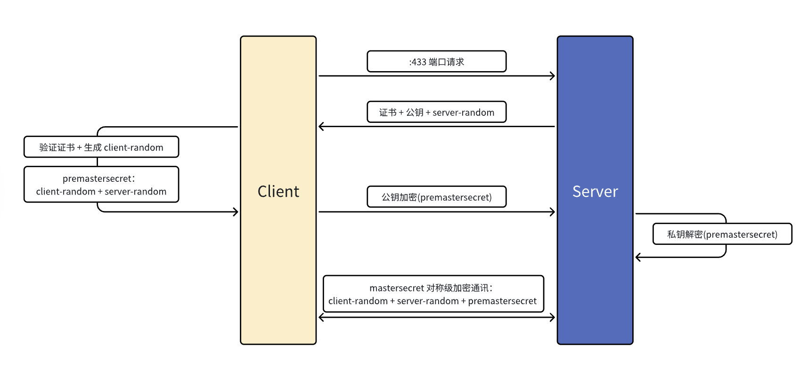
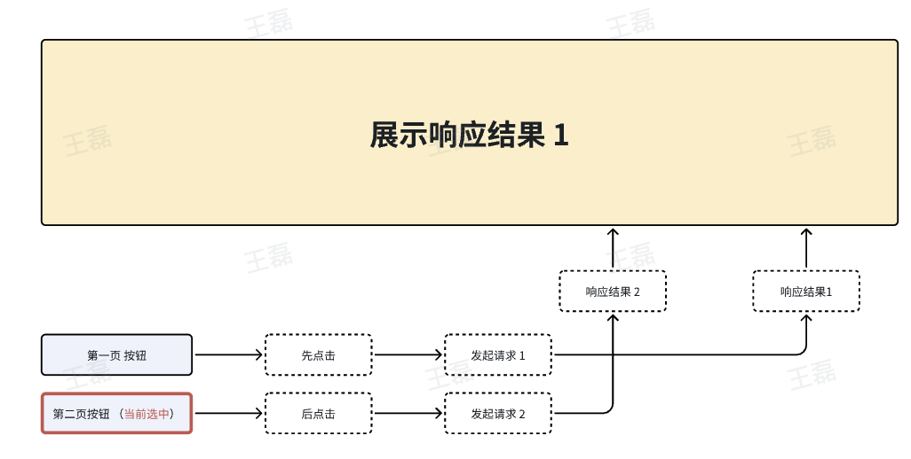
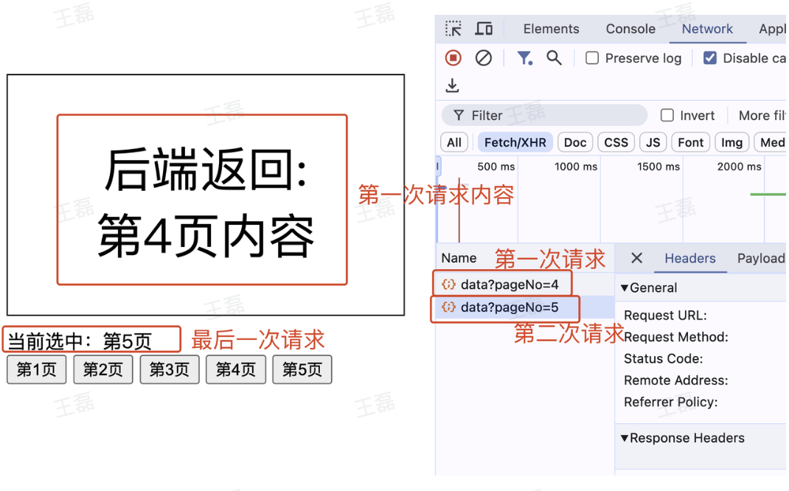
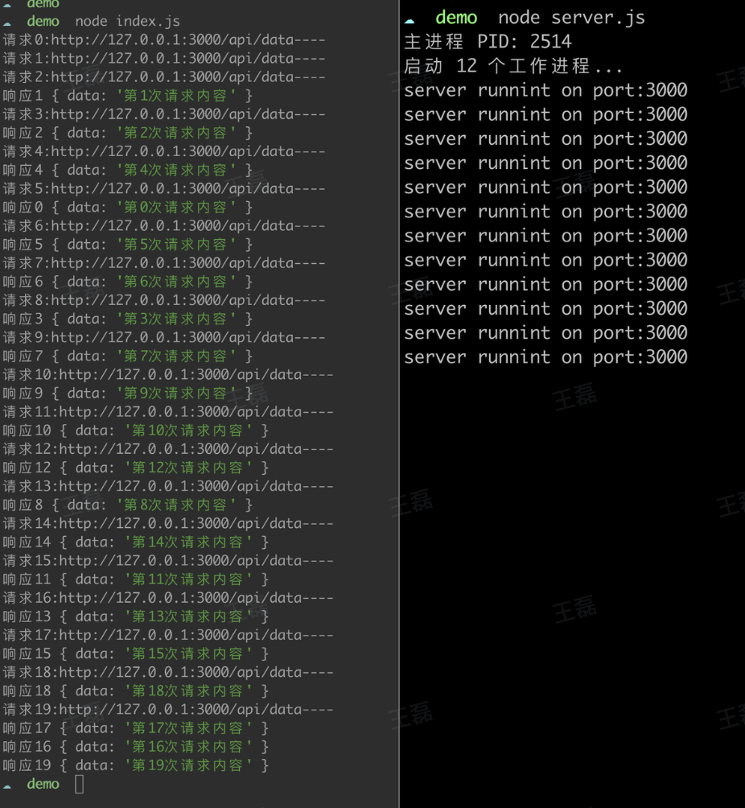

# 业务场景题目

## 问题1：页面上有多个按钮，分别响应不同的点击事件，如何优化？

```html
<html>​
<head>​
  <style type="text/css">​
    .box {​
      margin-bottom: 10px;​
      width: 100px;​
      height: 50px;​
      background-color: blue;​
      text-align: center;​
      font-size: 25px;​
      color: white;​
      line-height: 50px;​
    }​
  </style>​
</head>​
<body>​
  <div id="box1" class="box" onclick="boxClick1()">1</div> ​
  <div id="box2" class="box" onclick="boxClick2()">2</div>​
  <div id="box3" class="box" onclick="boxClick3()">3</div>​
  <div id="box4" class="box" onclick="boxClick4()">4</div>​
  <div id="box5" class="box" onclick="boxClick5()">5</div>​
  <script type="text/javascript">​
    function boxClick1() {​
      console.log(1);​
    }​
    function boxClick2() {​
      console.log(2);​
    }​
    function boxClick3() {​
      console.log(3);​
    }​
    function boxClick4() {​
      console.log(4);​
    }​
    function boxClick5() {​
      console.log(5);​
    }​
  </script>​
</body>​
</html>
```

优化方案：采取事件代理的方式进行优化，把事件绑定到父或根元素中，把多个监听器合并为一个，减少性能损耗。

```html
<html>​
<head>​
  <style type="text/css">​
    .box {​
      margin-bottom: 10px;​
      width: 100px;​
      height: 50px;​
      background-color: blue;​
      text-align: center;​
      font-size: 25px;​
      color: white;​
      line-height: 50px;​
    }​
  </style>​
</head>​
<body>​
  <div id="box1" class="box">1</div> ​
  <div id="box2" class="box">2</div>​
  <div id="box3" class="box">3</div>​
  <div id="box4" class="box">4</div>​
  <div id="box5" class="box">5</div>​
  <script type="text/javascript">​
    document.body.addEventListener('click', (e) => {​
      const eventMap = {​
        box1: boxClick1,​
        box2: boxClick2,​
        box3: boxClick3,​
        box4: boxClick4,​
        box5: boxClick5​
      };​
      eventMap[e.target.id]();​
    });​
    function boxClick1() {​
      console.log(1);​
    }​
    function boxClick2() {​
      console.log(2);​
    }​
    function boxClick3() {​
      console.log(3);​
    }​
    function boxClick4() {​
      console.log(4);​
    }​
    function boxClick5() {​
      console.log(5);​
    }​
  </script>​
</body>​
</html>
```

## 问题2：登录无感刷新实现方案​

利用 “双token机制”，首次登录成功服务器返回 accessToekn(短期有效) + refreshToekn(长期有效)，日常业务请求，利用 accessToken，一旦 accessToken 失效，则利用 refreshToekn 请求服务器，换取新的 accessToken。



## 问题3：频繁切换页码，导致页码和数据不对应，解决方案。​

本质原因：用户频繁切换页面发出了多个请求，但由于网络速度波动，请求顺序和响应顺序不能保证一致。



案例代码：​

- client

```html
<!DOCTYPE html>​
<html>​
<head>​
  <meta charset="utf-8">​
  <title></title>​
  <style type="text/css">​
    .content{​
      border: 1px solid black;​
      padding: 50px;​
      width: 230px;​
      height: 100px;​
      margin: 50px 0 10px 0;​
      text-align: center;​
      font-size: 40px;​
    }​
  </style>​
</head>​
<body>​
  <div id="content" class="content"></div>​
  <div id="currentPage"></div>​
  <input id="btn1" type="button" value="第1页" />​
  <input id="btn2" type="button" value="第2页" />​
  <input id="btn3" type="button" value="第3页" />​
  <input id="btn4" type="button" value="第4页" />​
  <input id="btn5" type="button" value="第5页" />​
</body>​
<script type="text/javascript">​
const handler = async (pageNo) => {​
  document.getElementById('currentPage').innerHTML = `当前选中：第${pageNo}页`;​
  fetch('http://127.0.0.1:3000/api/data?pageNo=' + pageNo).then(async (res) => {​
    const resData = await res.json();​
    document.getElementById('content').innerHTML = `后端返回: <br/> ${resData.data}`;​
  }).catch(e => {​
    console.log(e);​
  });​
}​
document.getElementById('btn1').addEventListener('click', () => { handler(1) });​
document.getElementById('btn2').addEventListener('click', () => { handler(2) });​
document.getElementById('btn3').addEventListener('click', () => { handler(3) });​
document.getElementById('btn4').addEventListener('click', () => { handler(4) });​
document.getElementById('btn5').addEventListener('click', () => { handler(5) });​
</script>​
</html>
```

- server

```html
const cluster = require('cluster');​
const os = require('os');​
const Koa = require('koa');​
const KoaRouter = require('koa-router');​
​
if (cluster.isMaster) {​
  const cpuCount = os.cpus().length;​
  console.log(`主进程 PID: ${process.pid}`);​
  console.log(`启动 ${cpuCount} 个工作进程...`);​
  for (let i = 0; i < cpuCount; i++) {​
    cluster.fork(); // 创建子进程​
  }​
} else {​
  const app = new Koa();​
  const router = new KoaRouter();​
​
  app.use(async (ctx, next) => {​
    ctx.set('Access-Control-Allow-Origin', '*');​
    await next();​
  });​
​
  const sleep = (time) => {​
    const start = Date.now();​
    while(Date.now() - start < time) {}​
  }​
​
  // http:127.0.0.1:3000/api/data?pageNo=1​
  router.get('/api/data', async(ctx) => {​
    const { pageNo } = ctx.request.query;​
    await sleep(Math.random() * 3000); // 模拟不同进程间的接口延迟情况​
    ctx.body = {​
      data: `第${pageNo}页内容`​
    }​
  });​
​
  app.use(router.routes());​
  app.use(router.allowedMethods());​
​
  const port = 3000;​
  const host = '127.0.0.1';​
  app.listen(port, host);​
  console.log('server runnint on port:' + port);​
}
```

- 效果(问题呈现)



解决方案：​

1. 添加 loading（影响体验）

    ```js
    let loading = false;​
    const handler = async (pageNo) => {​
    if (loading) { return; }​
    loading = true;​
    document.getElementById('currentPage').innerHTML = `当前选中：第${pageNo}页`;​
    fetch('http://127.0.0.1:3000/api/data?pageNo=' + pageNo, {​
        signal: controller.signal​
    }).then(async (res) => {​
        const resData = await res.json();​
        document.getElementById('content').innerHTML = `后端返回: <br/> ${resData.data}`;​
    }).catch(e => {​
        loading = false;​
        console.log(e);​
    });​
    }
    ```

2. 取消请求（fetch / xhr / axios）

    ```js
    // fetch 取消方式​
    let controller;​
    const handler = async (pageNo) => {​
    if (controller) { controller.abort(); }​
    document.getElementById('currentPage').innerHTML = `当前选中：第${pageNo}页`;​
    ​
    controller = new AbortController();  ​
    fetch('http://127.0.0.1:3000/api/data?pageNo=' + pageNo, {​
        signal: controller.signal​
    }).then(async (res) => {​
        const resData = await res.json();​
        document.getElementById('content').innerHTML = `后端返回: <br/> ${resData.data}`;​
    }).catch(e => {​
        console.log(e);​
    });​
    }​
    ​
    // xhr 取消方式​
    let xhr;​
    const handler = async (pageNo) => {​
    if (xhr) { xhr.abort(); }​
    document.getElementById('currentPage').innerHTML = `当前选中：第${pageNo}页`;​
    const url = 'http://127.0.0.1:3000/api/data?pageNo=' + pageNo;​
    xhr = new XMLHttpRequest();​
    xhr.open('GET', url);​
    xhr.onreadystatechange = () => {​
        if (xhr.readyState === 4) {​
        if (xhr.status === 200) {​
            const resData = JSON.parse(xhr.responseText);​

            document.getElementById('content').innerHTML = `后端返回: <br/> ${resData.data}`;​
        } else {​
            console.log('请求失败或被中止');​
        }​
        }​
    };​
    xhr.send();​
    }​
    ​
    // axios 取消方式​
    const CancelToken = axios.CancelToken;​
    let cancel;​
    const handler = async (pageNo) => {​
    if (cancel) {​
        cancel();​
        cancel = null;​
    }​
    document.getElementById('currentPage').innerHTML = `当前选中：第${pageNo}页`;​
    const url = 'http://127.0.0.1:3000/api/data?pageNo=' + pageNo;​
    axios.get(url, {​
        cancelToken: new CancelToken(function executor(c) {​
        cancel = c; // 保存取消函数​
        }),​
    }).then(async (res) => {​
        const resData = res.data;​
        document.getElementById('content').innerHTML = `后端返回: <br/> ${resData.data}`;​
    }).catch(e => {​
        console.log(e);​
    });​
    }​
    ```

3. 添加 request_id（需要服务端配合）​

- client

```js
let curRequestId;​
const handler = async (pageNo) => {​
  curRequestId = Date.now();​
  document.getElementById('currentPage').innerHTML = `当前选中：第${pageNo}页`;​
  const url = 'http://127.0.0.1:3000/api/data?pageNo=' + pageNo + '&request_id=' + curRequestId;​
  fetch(url).then(async (res) => {​
    const resData = await res.json();​
    if (resData.request_id !== curRequestId) { return; } // 忽略不处理​
    document.getElementById('content').innerHTML = `后端返回: <br/> ${resData.data}`;​
  }).catch(e => {​
    console.log(e);​
  });​
}
```

- server

```js
router.get('/api/data', async(ctx) => {​
  const { request_id: requestId, pageNo } = ctx.request.query;​
  await sleep(Math.random() * 3000); // 模拟不同进程间的接口延迟情况​
  ctx.body = {​
    request_id: requestId,​
    data: `第${pageNo}页内容`​
  }​
});
```

## 问题4：webWorker 优化 100000000 数组遍历

```html
// worker.html​
<!DOCTYPE html>​
<html>​
<head>​
<title></title>​
<meta charset="utf-8" />​
<style type="text/css">​
.circle {​
  width: 300px;​
  height: 300px;​
  background-color: blue;​
  border-radius: 50%;​
  position: absolute;​
  animation: moveRightLeft 2s infinite alternate;​
}​
@keyframes moveRightLeft {​
  from {​
    left: 100px;​
  }​
  to {​
    left: 800px;​
  }​
}​
</style>​
<script type="text/javascript">​
  const worker = new Worker('./worker.js');​
  worker.onmessage = function(res) {​
    console.log('list.length: ', res.data);​
  }​
  setTimeout(() => {​
    worker.postMessage({});​
  }, 1000);​
</script>​
</head>​
<body>​
  <div class="circle"></div>​
</body>​
</html>
```

```js
// worker.js​
self.onmessage = function(req) {​
  const list = [];​
  for (let i = 0; i < 100000000; ++i) {​
    list.push(Date.now());​
  }​
  self.postMessage(list.length);​
}
```

## 问题5：requestIdleCallback 优化 100000000 数组遍历​

requestIdleCallback 会在浏览器每帧剩余的空闲时间内执行

```html
<!DOCTYPE html>​
<html>​
<head>​
<title></title>​
<meta charset="utf-8" />​
<style type="text/css">​
.circle {​
  width: 300px;​
  height: 300px;​
  background-color: blue;​
  border-radius: 50%;​
  position: absolute;​
  animation: moveRightLeft 2s infinite alternate;​
}​
@keyframes moveRightLeft {​
  from {​
    left: 100px;​
  }​
  to {​
    left: 800px;​
  }​
}​
</style>​
<script type="text/javascript">​
  const len = 100000000;​
  const list = [];​
  const runner = function(deadline) {​
    while(deadline.timeRemaining() > 0 && list.length < len) {​
      list.push(Date.now());​
    }​
    if (list.length < len) {​
      requestIdleCallback(runner);​
    }​
    console.log('数组长度:', list.length);​
  }​
  requestIdleCallback(runner);​
</script>​
</head>​
<body>​
  <div class="circle"></div>​
</body>​
</html>
```

## 问题6：虚拟列表，如果子元素高度不固定，处理方案​

1. **动态计算子元素高度**： 首先，你需要在渲染子元素之前动态计算每个子元素的高度。

    ````js
    const childElement = document.getElementById("child-element");​
    const childHeight = childElement.clientHeight;
    ````

2. **存储高度信息**： 一旦你计算了每个子元素的高度，你可以将这些高度信息存储在一个数组中，其中索引对应于子元素在虚拟列表中的位置。

    ```js
    const childHeights = [100, 150, 120, ...]; // 存储子元素的高度
    ```

3. **根据高度信息渲染子元素**： 在虚拟列表中，使用已存储的子元素高度信息来计算视口中应该渲染哪些子元素。根据已知的子元素高度和视口的高度来动态计算可见子元素的数量。通过维护一个滚动位置，可以确定哪些子元素应该在视口中渲染，然后只渲染这些子元素。

## 问题7：处理并发请求控制，同时最高并发 n 个请求，响应后逐个补充。

- client 端代码

```js
const axios = require('axios');​
​
function multiRqeust(urls, max) {​
  return new Promise(resolve => {​
    let urlIndex = 0;​
    let doneCount = 0;​
    const result = [];​
    ​
    function _request() {​
      const url = urls[urlIndex];​
      if (!url) { return; }​
      (function(reqIndex) {​
        console.log(`请求${reqIndex}:${url}----`);​
        axios.get(`${url}?reqIndex=${reqIndex}`).then(res => {​
          console.log(`响应${reqIndex}`, res.data);​
          result[reqIndex] = res.data;​
          if (doneCount++ >= urls.length) {​
            resolve(result);​
            return;​
          }​
          _request();​
        });​
      })(urlIndex++)​
    }​
    for (let i = 0; i < Math.min(urls.length, max); ++i) {​
      _request();​
    }​
  });​
}​
​
multiRqeust([​
  'reqIndexreqIndex',​
  'http://127.0.0.1:3000/api/data',​
  'http://127.0.0.1:3000/api/data',​
  'http://127.0.0.1:3000/api/data',​
  'http://127.0.0.1:3000/api/data',​
  'http://127.0.0.1:3000/api/data',​
  'http://127.0.0.1:3000/api/data',​
  'http://127.0.0.1:3000/api/data',
  'http://127.0.0.1:3000/api/data',​
  'http://127.0.0.1:3000/api/data',​
  'http://127.0.0.1:3000/api/data',​
  'http://127.0.0.1:3000/api/data',​
  'http://127.0.0.1:3000/api/data',​
  'http://127.0.0.1:3000/api/data',​
  'http://127.0.0.1:3000/api/data',​
  'http://127.0.0.1:3000/api/data',​
  'http://127.0.0.1:3000/api/data',​
  'http://127.0.0.1:3000/api/data',​
  'http://127.0.0.1:3000/api/data',​
  'http://127.0.0.1:3000/api/data',​
], 3).then((res) => {​
  console.log('done', res);​
});
```

- server 端测试代码

```js
const cluster = require('cluster');​
const os = require('os');​
const Koa = require('koa');​
const KoaRouter = require('koa-router');​
​
if (cluster.isMaster) {​
  const cpuCount = os.cpus().length;​
  console.log(`主进程 PID: ${process.pid}`);​
  console.log(`启动 ${cpuCount} 个工作进程...`);​
  for (let i = 0; i < cpuCount; i++) {​
    cluster.fork(); // 创建子进程​
  }​
} else {​
  const app = new Koa();​
  const router = new KoaRouter();​
​
  const sleep = (time) => {​
    const start = Date.now();​
    while(Date.now() - start < time) {}​
  }​
​
  // http:127.0.0.1:3000/api/data?reqIndex=1​
  router.get('/api/data', async(ctx) => {​
    const { reqIndex } = ctx.request.query;​
    await sleep(Math.random() * 1000); // 模拟不同进程间的接口延迟情况​
    ctx.body = {​
      data: `第${reqIndex}次请求内容`​
    }​
  });​
​
  app.use(router.routes());​
  app.use(router.allowedMethods());​
​
  const port = 3000;​
  const host = '127.0.0.1';​
  app.listen(port, host);​
  console.log('server runnint on port:' + port);​
}
```

- 效果

