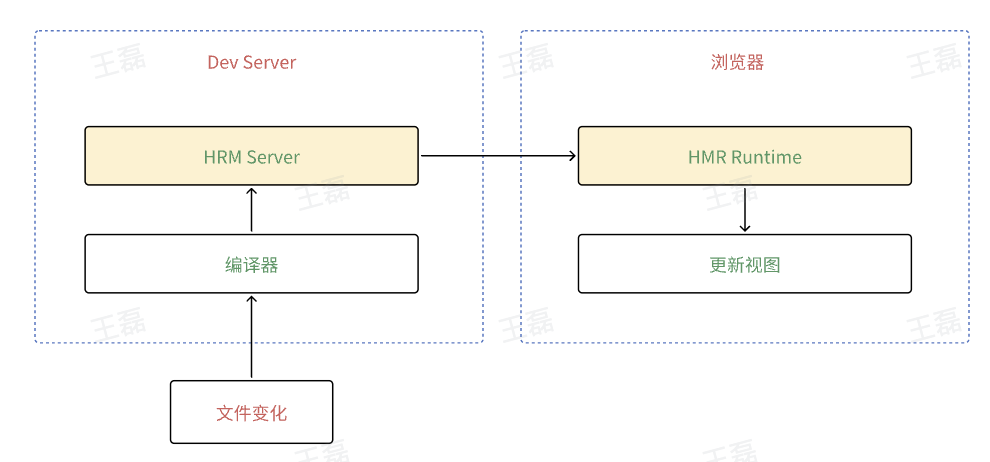

# 前端构建&工程化题目

## 1. 问题：webpack 的作用

Webpack是一个现代的前端模块打包工具，它用于构建和优化Web应用程序的前端资源，包括JavaScript、CSS、图片、字体等。Webpack的主要目标是将项目的所有依赖项（模块、资源文件）打包到一个或多个最终的静态文件中，以便在浏览器中加载。改善前端开发的工作流程，提高代码的可维护性和性能，解决了模块化、资源管理、性能优化和自动化等多个关键问题。

## 2. 问题：Webpack 的构建流程

1. __读取配置文件__：Webpack首先会读取项目中的配置文件（通常是webpack.config.js），该配置文件包含了构建过程中的各种设置，如入口文件、输出目录、加载器（loaders）、插件（plugins）等。​
2. __解析入口文件__：Webpack会根据配置文件中定义的入口点（entry points）来解析应用程序的依赖关系。入口文件通常是应用程序的主要JavaScript文件，但也可以有多个入口点。​
3. __依赖解析__：Webpack分析入口文件和其依赖的模块，构建一个依赖关系图，以确定哪些模块依赖于其他模块，以及它们之间的依赖关系。​
4. __加载器处理__：Webpack使用加载器来处理不同类型的资源文件，如CSS、图片、字体等。加载器允许开发人员在构建过程中转换这些资源文件，以便将它们整合到最终的输出文件中。​
5. __插件处理__：Webpack提供了插件系统，插件用于执行各种任务，如代码压缩、资源优化、HTML生成、热模块替换（HMR）等。插件可以根据需要自定义Webpack的构建过程。​
6. __生成输出文件__：Webpack根据入口文件和依赖关系图生成一个或多个输出文件。这些输出文件包括JavaScript文件、CSS文件、图片、字体等资源文件。​
7. __优化和压缩__：Webpack可以进行各种优化，包括代码压缩、Tree Shaking、懒加载等，以减小包的大小并提高性能。​
8. __生成Source Maps__：Webpack可以生成Source Maps，以便在开发中进行调试。Source Maps是一种映射文件，将最终输出文件映射回原始源代码。​
9. __输出到指定目录__：最终的构建结果被输出到配置文件中指定的目录中，通常是一个名为"dist"的目录。输出文件的命名和目录结构也可以根据配置进行自定义。​
10. __完成构建过程__：Webpack构建过程完成后，它会生成构建报告，包括构建成功或失败的信息，输出文件的大小等统计信息。

## 3. 问题：Webpack 的热更新原理



1. __监控文件变化__：Webpack的开发服务器会监控项目中所有的模块文件，包括：JS文件、CSS文件、模板文件等。​
2. __模块热替换__：当你在代码中做出更改并保存时，Webpack检测到文件变化，会首先通过热替换插件（Hot Module Replacement Plugin）生成新的模块代码。​
3. __构建更新的模块__：生成的新模块代码会被构建成一个独立的文件或数据块。​
4. __通知客户端__：Webpack开发服务器会将更新的模块代码的信息发送到浏览器。​
5. __浏览器端处理__：浏览器接收到更新的模块信息后，会在不刷新页面的情况下通过热替换运行时（Hot Module Replacement Runtime）替换相应的模块。​
6. __应用程序状态保持__：热更新还可以保持应用程序的状态。当修改代码不会丢失已有的数据、用户登录状态等。​
7. __回调处理__：允许在模块更新时执行自定义的回调函数，可以处理特定的逻辑，以确保模块更新后的正确性。​

## 4. 问题：webpack 常用 Loader

- __Babel Loader__：用于将新版JavaScript（如ES6+）转换为旧版JavaScript，以确保在不同浏览器中的兼容性。解决了不同JavaScript版本之间的问题。​
- __CSS Loader__：处理CSS文件，使其能够被打包到应用程序中。可以配合其他Loader（如style-loader）一起使用，以处理CSS的导入、模块化等问题。​
- __Style Loader__：将CSS样式加载到页面中，通常与CSS Loader一起使用。​
- __File Loader__：处理文件资源（如图片、字体等），将它们复制到输出目录，并返回文件路径。__URL Loader__：与File Loader类似，但可以将小文件转换为Base64编码的Data URL，以减小HTTP请求的数量。​
- __Sass/SCSS Loader__：处理Sass或SCSS样式文件，将它们转换为CSS，以便在浏览器中使用。​
- __Less Loader__：处理Less样式文件，将它们转换为CSS。​
- __PostCSS Loader__：通过PostCSS插件对CSS进行转换，以实现自动前缀、代码压缩、变量替换等任务。​
- __Image Loader__：处理图片文件，包括压缩、优化和Base64编码等操作。​
- __Vue Loader__：用于加载和解析Vue.js单文件组件，包括模板、脚本和样式。​
- __TypeScript Loader__：将TypeScript代码转换为JavaScript，使其可以在浏览器中运行。​
- __ESLint Loader__：与ESLint集成，用于在构建过程中进行代码质量检查，查找潜在的问题并确保代码规范。

## 5. 问题：webpack 常用 Plugin

- __HtmlWebpackPlugin__：用于生成HTML文件，并自动引入打包后的JavaScript和CSS文件。它还支持模板，可以根据模板生成HTML，非常适合单页应用。​
- __MiniCssExtractPlugin__：用于提取CSS文件到单独的文件，而不是将CSS嵌入到JavaScript中，这有助于提高性能和代码可维护性。​
- __CleanWebpackPlugin__：用于在每次构建前清理输出目录，确保输出目录中不会残留旧的文件。​
- __CopyWebpackPlugin__：用于复制静态文件（如图片、字体等）到输出目录，以便在生产环境中引用。​
- __DefinePlugin__：允许你在代码中定义全局常量，用于在开发和生产环境中切换配置，例如设置API的不同地址。​
- __HotModuleReplacementPlugin__：用于启用Webpack的热模块替换（HMR）功能，允许在开发过程中实时查看代码更改的效果。​
- __ProvidePlugin__：用于在代码中自动加载模块，可以减少模块导入的代码，例如自动引入jQuery等。​
- __BundleAnalyzerPlugin__：用于分析构建输出的包大小，帮助识别和解决优化问题。​
- __FriendlyErrorsWebpackPlugin__：改善开发体验，提供更友好的构建错误信息，以便更容易定位问题。​
- __ESLintWebpackPlugin__：集成ESLint代码检查，用于在构建过程中检测和修复代码问题。​
- __stylelint-webpack-plugin__：用于集成stylelint，对CSS和Sass等样式文件进行代码检查。

## 6.问题：Loader 和 Plugin 的区别

Loader 用于处理资源文件，使其能够成为模块。​
Plugin 用于执行构建过程中的各种任务和优化，扩展Webpack的功能。​

### Loader 详解
1. __作用__：处理模块中的资源文件，将它们转换为Webpack可以理解的模块。​
2. __资源处理__：处理各种资源文件，如JavaScript、CSS、图片、字体等，执行加载、转换、编译等任务。​
3. __模块级别__：工作在模块级别，通常用于处理单个文件或模块，它们直接与模块的内容交互。​
4. __配置__：通过module.rules进行配置，规定了哪些文件需要使用哪些Loader进行处理。​
5. __示例__：Babel Loader用于将ES6+ JavaScript转换为ES5，CSS Loader用于加载和处理CSS文件等。​

### Plugin 详解
1. __作用__：用于扩展Webpack的功能，执行各种自定义构建任务和优化。​
2. __构建过程控制__：可以介入Webpack的构建过程，在不同的生命周期阶段执行任务，如代码压缩、文件生成、HTML注入等。​
3. __应用级别__：工作在应用程序级别，可以操作整个构建过程，包括资源文件的加载和输出。​
4. __配置__：通过plugins进行配置，开发者可以根据需要添加不同的插件来扩展构建功能。​
5. __示例__：HtmlWebpackPlugin用于生成HTML文件，UglifyJSPlugin用于代码压缩等。

## 7.问题：写一个 loader 

```js
// 1. 导出一个函数，该函数接收源代码作为参数​
module.exports = function (source) {​
  // 2. 执行你的转换逻辑​
  // 这里我们使用正则表达式将所有的console.log语句替换为空字符串​
  const modifiedSource = source.replace(/console\.log\(.+?\);/g, '');​
  // 3. 返回转换后的源代码​
  return modifiedSource;​
};
```

引用：webpack 配置
```js
module.exports = {​
  // 其他配置...​
  module: {​
    rules: [​
      {​
        test: /\.js$/, // 匹配.js文件​
        use: 'my-console-log-loader', // 指定自定义的Loader​
      },​
    ],​
  },​
};
```

## 8.问题：写一个 Plugin
```js
class BundleReportPlugin {​
  constructor(options) {​
    this.options = options || {};​
  }​
​
  apply(compiler) {​
    compiler.hooks.emit.tapAsync('BundleReportPlugin', (compilation, callback) => {​
      const timestamp = new Date().toLocaleString();​
      const moduleCount = Object.keys(compilation.modules).length;​
​
      const reportContent = `Bundle Report - ${timestamp}\nTotal Modules: ${moduleCount}`;​
​
      compilation.assets['bundle-report.txt'] = {​
        source: () => reportContent,​
        size: () => reportContent.length,​
      };​
​
      callback();​
    });​
  }​
}​
​
module.exports = BundleReportPlugin;
```
引用：webpack 配置
```js
const BundleReportPlugin = require('./BundleReportPlugin');​
​
module.exports = {​
  // 其他配置...​
  plugins: [​
    new BundleReportPlugin(),​
  ],​
};
```

## 9.问题：Webpack 构建速度提升

1. 升级Webpack版本：使用最新版本的Webpack，因为每个新版本通常都会包含性能改进和优化。​
2. 使用持久缓存：配置Webpack以生成长期缓存的文件名，在构建时只有修改过的文件需要重新构建。​
3. 配置最小的loader规则：只使用必要的loader规则，避免不必要的文件处理，以减小构建时间。​
4. 使用HappyPack：HappyPack是一个多线程Loader处理工具，可以加速构建过程。​
5. 使用thread-loader：类似于HappyPack，thread-loader也可以将loader任务分发给多个线程。​
6. 使用DLL（动态链接库）：将不经常更改的依赖库（如React、Vue等）打包为DLL，以减少构建时间。​
7. 使用缓存：配置Webpack的缓存，以避免在每次构建时重新加载依赖。​
8. 减少模块数量：优化项目，减少模块和依赖的数量，以减小构建时间。​
9. Code Splitting：使用Webpack的代码分割功能，以减小每次构建需要处理的模块数量。​
10. 优化loader：选择高效的loader，或者编写自定义loader以提高处理速度。​
11. 优化插件：选择和配置插件，确保它们不会导致构建速度变慢。​
12. 使用Tree Shaking：启用Webpack的Tree Shaking功能，以删除未使用的代码，减小包的大小。​
13. 使用resolve配置：通过Webpack的resolve配置来减小模块查找时间，提高构建速度。​
14. 开发模式和生产模式分离：确保区分开发和生产构建模式，以避免不必要的开发工具和代码优化。​
15. 使用Webpack Dev Server：可以提供热模块替换（HMR）和快速重构建。​
16. 分析工具：使用Webpack Bundle Analyzer等分析工具来识别和解决包大小过大的问题。

## 10.问题：Webpack 神奇注释

Webpack的"神奇注释"（Magic Comments）是一种特殊的注释语法，用于在Webpack打包过程中提供附加的指令和配置信息。这些注释以特殊的格式编写，并可以影响Webpack的行为。​

1.Chunk名称注释：用于动态导入的模块指定生成的Chunk文件的名称。​
​
```js
import(/* webpackChunkName: "my-chunk" */ './my-module');​
```
​
2.Chunk模式注释：用于指定模块的加载模式，如"lazy"、"lazy-once"、"eager"等。​
​
```js
import(/* webpackMode: "lazy-once" */ './my-module');​
```

3.Chunk预取注释：用于指定是否在空闲时预取模块。​
​
```js
import(/* webpackPrefetch: true */ './my-module');​
```
​
4.Chunk预加载注释：用于指定是否在当前模块加载后立即预加载模块。​
​
```js
import(/* webpackPreload: true */ './my-module');​
```
​
这些神奇注释可以在Webpack的动态导入中使用，以帮助控制Chunk的生成、加载模式和优化策略。

## 11.问题：webpack 分包案例
目的：尽量按改动频率区分，利用浏览器缓存​

1.vendor: 第三方lib库，基本不会改动，除非依赖版本升级​

2.common: 业务组件代码的公共部分抽取出来，改动较少​

3.entry: 不同页面entry里业务组件代码的差异部分，会经常改动

## 12.问题：Webpack 和 Vite 的区别

Webpack 一个打包工具（对标 Rollup），静态构建，在项目工程化，依赖，打包，构建等过程发挥作用。​

Vite 是一个更上层的工具链方案，对标的是 （webpack + 针对 web 的常用配置 + webpack-dev-server）。旨在提供快速的开发体验，它使用ES模块（ES modules）和现代浏览器特性来实现即时开发，不需要预构建或编译。

## 13.问题：Babel 的原理
Babel是一个广泛使用的JavaScript编译工具，它的主要原理是将新版本的JavaScript代码（通常是ES6+）转换为向后兼容的JavaScript代码，以便在旧版JavaScript引擎上运行。​

___工作原理如下：​___

1.___解析（Parsing）：___ Babel首先将输入的JavaScript代码解析成抽象语法树（AST）。AST是代码的抽象表示，它将代码分解成语法树节点，以便后续的分析和转换。​

2.___转换（Transformation）：___ 在AST的基础上，Babel执行一系列插件和转换器，对代码进行修改和转换。这些转换可以包括将新语法转换为旧语法、应用代码优化、插入Polyfill等。Babel的转换过程是插件驱动的，每个插件负责特定的转换任务。
​

3.___生成（Code Generation）：___ 完成转换后，Babel将修改后的AST转换回JavaScript代码字符串。这个过程涉及将AST节点逐个还原为代码，以生成最终的代码输出。​

Babel的主要功能是将现代JavaScript代码转换为ES5或更早版本的JavaScript，以确保它可以在不支持新语法的浏览器和JavaScript引擎上运行。这使开发人员能够利用新的语言功能而不担心向后兼容性问题。此外，Babel还可以执行其他任务，如模块转换、TypeScript支持、Flow类型检查等。Babel的插件系统允许开发人员创建自定义的转换和功能，以满足项目的需求。

## 14.问题：模块化与组件化的区别
模块化：​

1.___重点___：模块化主要关注代码的组织和封装。它将代码分割成小的独立单元（模块），每个模块通常负责特定功能或任务。​

2.___应用领域___：模块化通常用于管理和组织JavaScript代码。它适用于将大型代码库分割为可管理的部分，以提高可维护性和可重用性。​

3.___特点___：模块化通过导入和导出语法来定义模块之间的依赖关系，例如CommonJS、ES6模块、AMD等。它通常在服务器端（Node.js）和客户端（浏览器）开发中都有应用。​
​

___组件化___：​

1.___重点___：组件化主要关注构建用户界面和交互。它将用户界面的不同部分拆分成可重用的组件，每个组件包含了特定的UI元素和交互逻辑。​

2.___应用领域___：组件化通常用于前端开发，特别是用于构建Web应用程序的用户界面。它有助于将界面分解为独立、可重用的部分，以提高开发效率和用户体验。​

3.___特点___：组件化通常使用组件库或框架（如React、Vue、Angular）来创建、组合和渲染可重用的UI组件。每个组件通常包含HTML模板、CSS样式和JavaScript代码，可以嵌套在应用程序的不同位置，以构建复杂的用户界面。​
​
综上所述，___模块化___主要关注代码的组织和封装，而组件化主要关注构建可重用的用户界面部分。虽然它们在某些方面有相似之处，但它们有不同的目标和应用领域。在实际项目中，通常会同时使用模块化和组件化的概念，以便更好地管理代码和开发用户界面。

## 15.问题：CommonJS 与 ESM（ECMAScript Modules） 的区别

CommonJS 模块通常用于服务器端（Node.js），在浏览器端需要使用工具进行转译或打包。​

ESM（ECMAScript Modules） 模块是浏览器原生支持的，可以直接在现代浏览器中使用，不需要额外的转译工具。​

1.___加载时机​___

- CommonJS：同步加载，模块在运行时（runtime）加载，并且是按需加载的，只有在需要时才会被加载。​
- ESM：静态加载的，模块在解析时加载，在代码执行之前就被加载，因此具有更早的加载时机。​

2.___依赖关系​___

- CommonJS：模块的依赖关系是动态的，意味着模块可以在运行时根据条件加载不同的依赖。​

- ESM：模块的依赖关系是静态的，依赖关系在模块加载之前就确定，不能根据条件改变依赖关系。​

3.___导出方式​___

- CommonJS：使用module.exports来导出模块，可以导出任意类型的值，包括函数、对象、类等。​
- ESM：使用export和import关键字来导出和导入模块。导出时需要明确指定导出的变量、函数或类，导入时也需要明确指定要导入的内容。​

4.___全局共享​___

- CommonJS：模块在每个模块中都有自己的作用域，不会污染全局作用域。​
- ESM：模块默认是严格模式（strict mode），变量不会污染全局作用域，模块内部的变量不被会提升。​
5.___静态分析​___

- CommonJS：模块的依赖关系无法在编译时静态分析，这对一些工具的性能和优化产生了挑战。​
- ESM：模块的依赖关系可以在编译时进行静态分析，这有助于提高性能和优化。​

6.___案例​___

- CommonJS​

``` js

// a.js​
module.exports = function greet(name) {​
  return `Hello, ${name}!`;​
}​
```

```js

// b.js​
const greet = require('a');​
console.log(greet('John'));​

```

- ESM​
​
```js
// a.js​
export function greet(name) {​
  return `Hello, ${name}!`;​
}​
```


```js
// b.js​
import { greet } from './module1.js';​
console.log(greet('John'));​
​
​
```


```html
<!DOCTYPE html>​
<html lang="en">​
<head>​
  <meta charset="UTF-8">​
  <meta name="viewport" content="width=device-width, initial-scale=1.0">​
  <title></title>​
  <style type="text/css"></style>​
  <script type="module" src="./a.js"></script>​
  <script type="module" src="./b.js"></script>​
</head>​
<body>​
</body>​
</html>​
```

CommonJS和ESM都用于模块化JavaScript，但它们在加载时机、依赖关系、导出方式、全局作用域等方面存在重要的区别。在浏览器端，ESM成为了官方的标准，而在服务器端（Node.js）仍然广泛使用CommonJS。选择哪种模块规范取决于你的项目需求和所支持的环境。如果需要在浏览器端使用ESM，请确保你的目标浏览器支持它，或者使用工具进行转译。

## 16.问题：关于服务端渲染（SSR）与客户端渲染（CSR）的理解

- 我们平常在浏览器页面，是有两种渲染方式的，一种是由浏览器渲染，叫 CSR，Client-Side Rendering，这也是绝大部分同学日常开发的模式。而另一种是方式则是由服务端渲染，Server-Side Rendering，简称 SSR。​
- 我们日常的 CSR 渲染逻辑是后端返回一个空白 html，浏览器接收到这个 html 后，再执行 vue 的初始化相关事情，再请求各个接口获取数据，最后再把数据填充在页面上。而 SSR ，则是由服务端完成这一系列行为，构建好 vue，后端从数据库取出要渲染的数据并填充在页面上。这样一来，页面对 SEO 变得友好，而且减少很多页面请求数据的交互，首屏能更快的完成渲染。但又因为有更多的逻辑在渲染前完成，可能会导致白屏时间过长，服务器压力变大，页面跳转也需要频繁的刷新页面，体验不友好。​
- 而在真实的开发中，不是非此即彼的，CSR 和 SSR 都有各自的优缺点，我自己的项目架构，往往是首屏服务器渲染，保证首页渲染速度，而次屏用浏览器渲染，保证用户体验。

## 17.问题：单页面应用（SPA）与多页面应用（MPA）的优劣

定义：

1.SPA 即为 single page application 的缩写，意为单页面应用，不刷新页面，路由跳转是基于特定的实现（如 vue-router，react-router 等前端路由），而非原生浏览器的文档跳转（navigating across documents）

2.MPA 即为 multiple page application 的缩写，意为多页面应用模型，与 SPA 对比最大的不同即是页面路由切换由原生浏览器文档跳转（navigating across documents）控制。跳转需刷新页面。

优点：
- SEO友好：由于每个页面都是独立的，所以对搜索引擎更友好。
- 初始加载速度：通常，初次加载页面的速度比 SPA 快，因为只加载当前页面需要的资源。
- 简单的缩放：服务器端处理可以更容易地缩放应用，因为客户端只承担了少部分工作。

缺点：
- 用户体验：每次页面跳转都会导致整个页面刷新，可能影响用户体验。
- 资源重复加载：在每个页面上，很多相同的资源（如样式表和脚本）可能需要被重复加载。
- 前后端耦合：SMA 通常涉及到前后端代码更紧密的耦合，可能使得开发和维护变得更复杂。

选择考虑因素：（需要根据具体需求和场景进行考虑，不是非此即彼）
- 项目规模和复杂性：对于复杂的交互式应用（如在线文档编辑器、社交网络等），SPA 可能是更好的选择。而对于简单的内容导向网站，SMA 可能更合适。
- 用户体验需求：如果需要提供流畅的用户体验和复杂的客户端交互，SPA 更有优势。
- 搜索引擎优化需求：如果 SEO 是关键考虑因素，SMA 或利用服务器端渲染的 SPA 可能更合适。
- 开发资源和专长：SPA 需要前端框架的知识，而 SMA 可能更依赖于传统的服务器端技术。
- 维护和更新：SPA 可以更容易地推送更新，因为大部分逻辑都在客户端。SMA 则可能需要更频繁地进行服务器端的更新。