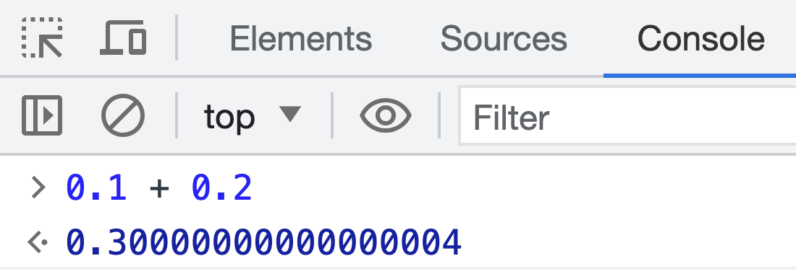

# 操作系统题目

## 问题1：0.1 + 0.2 为什么不等于 0.3 ？​

1. 小数转二进制是：乘2取整，到 0 结束  =>  乘不尽，无限小数。​
2. JS number 类型以 64 位 双精度浮点数 存储。​
3. IEEE754 标准，64位分为：1位符号位，11位指数位，52位小数位。​
4. 无限小数存放到 52位 会导致第一次精度丢失。​
5. 两数相加结果再次存放到 52位 会导致第二次精度丢失。​
6. 所以最终 0.1 + 0.2 的二进制结果再转化为十进制，就会变成 0.30000000000000004

## 问题2：线程与进程的区别​
- **定义:**

  - 进程：独立的执行环境，拥有独立的内存空间、文件描述符、系统资源和程序计数器，进程间都互相隔离。​

  - 线程：进程内的执行单元，多个线程可以共享相同的进程内存空间和资源，是进程的一部分，通常更轻量级。​

- **资源分配:**
  - 进程：每个进程都有独立的内存空间，因此进程之间不能直接共享数据。资源分配较为独立，但开销较大。​
  - 线程：线程共享进程的内存空间，可以直接访问进程内的数据，资源分配较为轻量。​

- **并发性:**
  - 进程：进程之间的并发性较低，因为它们是相对独立的。进程之间通信需要复杂的IPC（进程间通信）机制。​
  - 线程：线程在同一进程内并发执行，因此线程之间可以更容易地共享数据和通信，有更轻量的线程同步机制。​

- **开销：**
  - 进程：创建和销毁进程通常需要较多的时间和资源，因为需要分配和释放独立的内存空间、文件描述符等。​
  - 线程：创建和销毁线程通常开销较小，因为它们共享相同的进程资源。​

- **安全性：**
  - 进程：由于进程之间相互隔离，一个进程的崩溃通常不会影响其他进程。​
  - 线程：线程之间共享相同的内存空间，因此一个线程的错误可能会影响整个进程的稳定性。

- **通信：**
  - 进程：进程之间的通信需要使用IPC机制，例如管道、消息队列、共享内存、套接字等。​
  - 线程：线程之间的通信较为直接，可以共享内存或使用线程同步机制。​

- **适用场景：**
  - 进程：适用于需要高度隔离的应用，每个进程可以独立执行不同任务的情况。​
  - 线程：适用于需要共享数据和资源的应用，以提高并发性能的情况。

## 问题3：内存中的堆（Heap）和栈（Stack）​

**堆（Heap）**:​

1. **动态分配**：堆是一个用于动态分配内存的区域，在堆中分配内存通常在运行时进行，可按需动态分配或释放。​
2. **大小可变**：堆的大小是动态的，可以根据需要分配较大的内存块。​
3. **手动管理**：在许多编程语言中，堆内存通常需要开发人员负责分配和释放，以避免内存泄漏和内存溢出。​
4. **存储复杂数据**：堆通常用于存储较大、动态分配的数据结构，例如对象、数组、链表等。​
5. **堆溢出**：不正确的堆内存管理可能导致堆溢出，这会导致程序崩溃或不稳定。

​
**栈（Stack）**:​

1. **静态分配**：栈是一个用于静态分配内存的区域。在编译时或运行时，栈的大小通常是固定的。​
2. **大小固定**：栈的大小通常比堆小得多，因为它主要用于存储局部变量、函数调用信息和执行上下文。​
3. **自动管理**：栈内存的分配和释放通常是自动的，由编程语言和运行时环境负责。当函数调用结束时，栈上的局部变量会自动被销毁。​
4. **存储基本数据类型**：栈通常用于存储基本数据类型，例如整数、浮点数、指针等。它也用于存储函数调用的执行上下文，包括函数参数、返回地址等。​
5. **栈溢出**：栈通常有一个有限的大小，不正确的递归或嵌套函数调用可能导致栈溢出，这会导致程序崩溃。